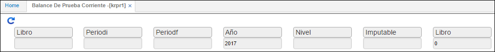
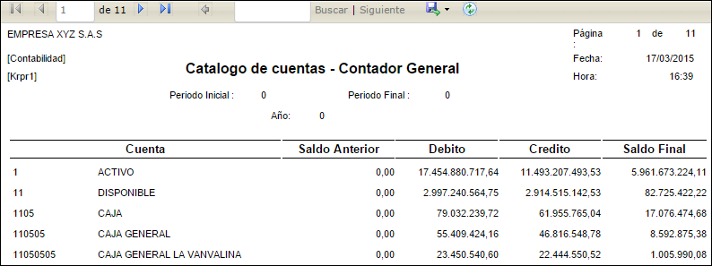

---

layout: default
title: Balance de Prueba Corriente
permalink: /Operacion/erp/contabilidad/kreporte/krpr1
editable: si

---

# Balance de Prueba Corriente - KRPR1

Este informe nos arroja un balance de prueba acumulado por periodos de acuerdo a la consulta.  

**Libro:** Ingresar el número de libro contable del cual se desea realizar la consulta (libro 1 - IFRS, libro 0 - Local).  
**PeriodoI:** Periodo inicial, desde donde desea consultar.  
**PeriodoF:** Periodo final, hasta donde desea consultar.  
**Año:** Año que desea consultar.  
**Nivel:** Número asignado según parametrización de BCUE.  
**Imputable:** S, N cuando el reporte se desee generar por cuentas imputables o no imputables.  

