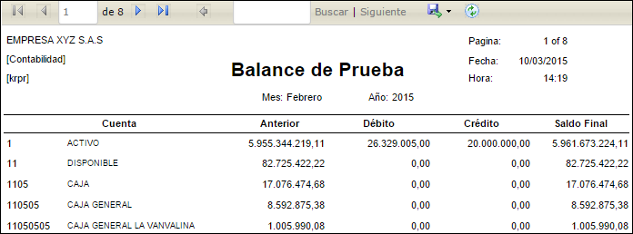

## Balance de Prueba por Centro Costo - KRPRC

En esta opción el sistema permite generar una consulta por pantalla o un informe impreso o en Excel detallando por centro de costos el movimiento debido y crédito de cada una de las cuentas que estén marcadas por centro de costo. Para su generación el sistema solicita periodo, año, nivel de cuentas contables, libro; en el cual se desea conocer el informe. 

**Periodo:** Mes que se desea consultar.  
**Año:** Año el cual deseo consultar.  
**Nivel:** Número del nivel asignado según la parametrización del BCUE.  
**Libro:** Número de libro asignado según parametrización de KLIB.  
**Centro Costo:** Número del centro de costo, segun BUBI.  

## Balance de Prueba por Proyecto - KRPRP

En esta opción el sistema permite generar una consulta por pantalla o un informe impreso o en Excel detallando por proyecto el movimiento debido y crédito de cada una de las cuentas que estén marcadas por proyecto. Para su generación el sistema solicita periodo, año, nivel, libro  

**Periodo:** Mes que se desea consultar.  
**Año:** Año el cual deseo consultar.  
**Nivel:** Número del nivel asignado según la parametrización del BCUE.  
**Libro:** Número de libro asignado según parametrización de KLIB.  
**Proyecto:** Número del Proyecto, segun BPRY.  

## Balance de Prueba

**Periodo:** Mes que se desea consultar.  
**Año:** Año el cual deseo consultar.  
**Nivel:** Número del nivel asignado según la parametrización del BCUE.  
**Libro:** Número de libro asignado según parametrización de KLIB.  

