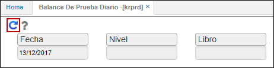
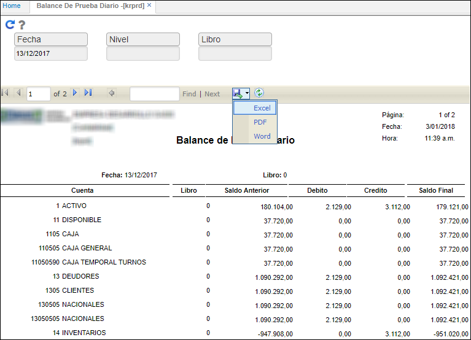

# KRPRD - Balance de prueba diario

El reporte KRPRD nos muestra información del balance contable de los saldos diarios generados en la aplicación [**KPSD - Saldos diarios**](http://docs.oasiscom.com/Operacion/erp/contabilidad/kproceso/kpsd).  

Ingresamos a la aplicación y consultamos por la fecha en que se generaron los saldos diarios.  

La aplicación arrojará la información del balance contable en un reporte, el cual puede ser descargado en formato de Excel, PDF o Word.  

