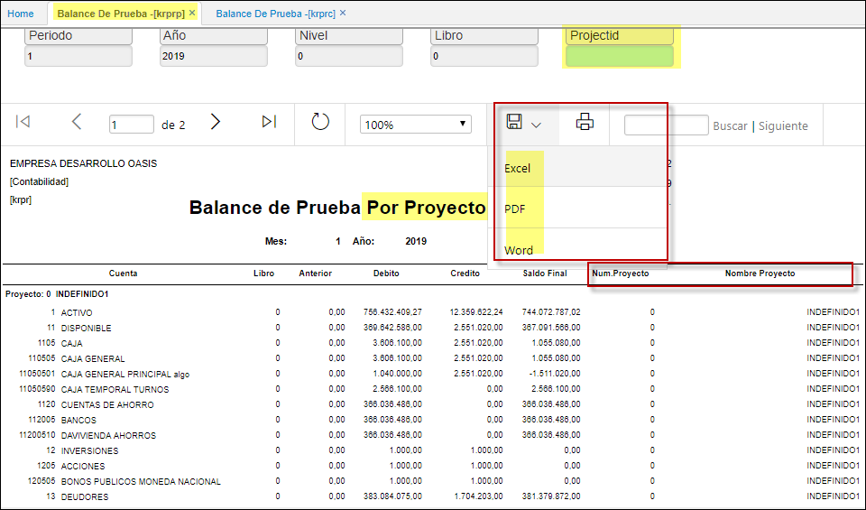

---

layout: default

title: Balance de Prueba por Proyecto

permalink: /Operacion/erp/contabilidad/kreporte/krprp

editable: si

---

## Balance de Prueba por Proyecto - KRPRP

En esta opción el sistema permite generar una consulta por pantalla o un informe impreso o en Excel detallando por proyecto el movimiento debido y crédito de cada una de las cuentas que estén marcadas por proyecto. Para su generación el sistema solicita periodo, año, nivel, libro  

**Periodo:** Mes que se desea consultar.  
**Año:** Año el cual deseo consultar.  
**Nivel:** Número del nivel asignado según la parametrización del BCUE.  
**Libro:** Número de libro asignado según parametrización de KLIB.  
**Proyecto:** Número del Proyecto, segun BPRY.  

