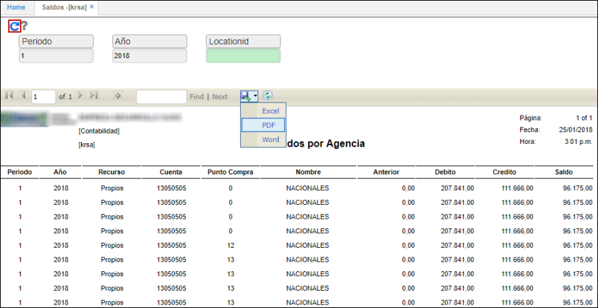

# Saldos por Agencia - KRSA

El reporte **KRSA** permite ver los saldos de cartera por agencia de café.  

En el reporte filtramos por periodo, año y ubicación. Seguidamente, damos clic en el botón .  

El reporte puede ser exportado en formato de Excel, PDF o Word.  

