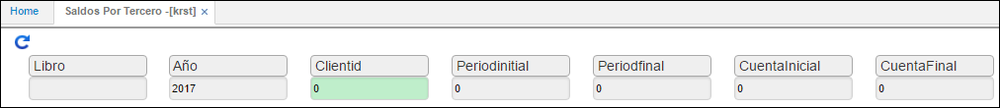

---

layout: default
title: Saldos por Tercero
permalink: /Operacion/erp/contabilidad/kreporte/krst
editable: si

---

## Saldos por Terceros - KRST

Este informe nos arroja los saldos contables acumulados por tercero. Se consulta ingresando año, periodo inicial, periodo final, cuenta inicial y cuenta final.  

Al consultar genera un informe similar al que a continuación se muestra.

