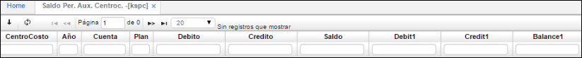
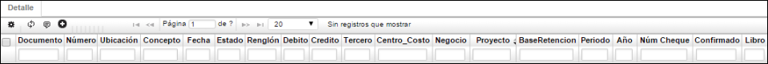

---
layout: default
title: Saldo Per. Aux. Centroc
permalink: /Operacion/erp/contabilidad/ksaldo/kspc
editable: si
---

## Saldo Per. Aux. Centroc - KSPC

Esta aplicación nos permite visualizar los saldos periódicamente de los centros de costo, se puede filtrar por año, cuenta, centro de costo.



**Centro Costo:** Identificación numérica del centro de costo al cual pertenece la cuenta.  
**Año:** Año al cual se va a realizar la consulta.  
**Cuenta:** Identificación numérica y nombre de la cuenta.  
**Débito:** Valor numérico de los movimientos débitos que se realizan durante el periodo.  
**Crédito:** Valor numérico de los movimientos créditos que se realizan durante el periodo.  
**Saldo:** Valor que tendrá la cuenta después de terminar el periodo.  

En el **Detalle** se encontrarán los siguientes campos:





**Documento:** Documentos que soportan el movimiento del maestro.  
**Numero:** Número de los documentos.  
**Ubicación:** Ubicación registrada para estos documentos.  
**Concepto:** Conceptos que se registraron para cada documento.  
**Fecha:** Fecha de registro de los documentos.  
**Estado:** Estado de los documentos, generalmente se encontrará en P de procesado.  
**Renglón:** Renglón del detalle del documento en el cual se registró la cuenta consultada en el maestro.  
**Débito:** Valor del documento si lo hay.  
**Crédito:** Valor del documento si lo hay.  
**Tercero:** Tercero asociado al documento.  
**Centro de costo:** Centro de costo asociado al documento.  
**Negocio:** Negocio asociado al documento.  
**Proyecto:** Proyecto asociado al documento.  
**Base de retención:** Base de retención del documento si aplica para la cuenta consultada en el maestro.  
**Periodo:** Periodo de registro del documento.  
**Año:** Año de registro del documento.  
**Núm Cheque:** número de cheque.  
**Libro:** Libro del documento.  




