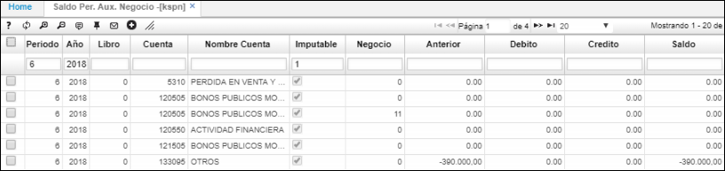
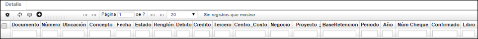

## Saldo Per. Aux. Negocio - KSPN

Esta aplicación nos permite visualizar los saldos periódicos filtrando por negocio. Los negocios deben estar parametrizados en la aplicación [**BNEG - Negocios**](http://docs.oasiscom.com/Operacion/common/bfinan/bneg).

**Periodo:** Valor numérico que identifica al mes.  
**Año:** Año al cual se va a realizar la consulta.  
**Cuenta:** Identificación numérica y nombre de la cuenta.  
**Imputable:** permite filtrar la información de los saldos que son imputables y los que no lo son. Para filtrar por los saldos imputables consultamos con el número 1.  
**Negocio:** Identificación numérica del negocio al cual pertenece la cuenta.  
**Anterior:** Valor que posee la cuenta antes de iniciar el periodo.  
**Debito:** Valor numérico de los movimientos débitos que se realizan durante el periodo.  
**Crédito:** Valor numérico de los movimientos créditos que se realizan durante el periodo.  
**Saldo:** Valor que tendrá la cuenta después de terminar el periodo.  

En el **Detalle** se encontrarán los siguientes campos:

**Documento:** Documentos que soportan el movimiento del maestro.  
**Numero:** Número de los documentos.  
**Ubicación:** Ubicación registrada para estos documentos.  
**Concepto:** Conceptos que se registraron para cada documento.  
**Fecha:** Fecha de registro de los documentos.  
**Estado:** Estado de los documentos, generalmente se encontrará en P de procesado.  
**Renglón:** Renglón del detalle del documento en el cual se registró la cuenta consultada en el maestro.  
**Débito:** Valor del documento si lo hay.  
**Crédito:** Valor del documento si lo hay.  
**Tercero:** Tercero asociado al documento.  
**Centro de costo:** Centro de costo asociado al documento.  
**Negocio:** Negocio asociado al documento.  
**Proyecto:** Proyecto asociado al documento.  
**Base de retención:** Base de retención del documento si aplica para la cuenta consultada en el maestro.  
**Periodo:** Periodo de registro del documento.  
**Año:** Año de registro del documento.  
**Núm Cheque:** número de cheque.  
**Libro:** Libro contable del documento.  

