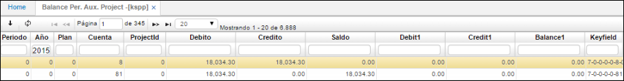
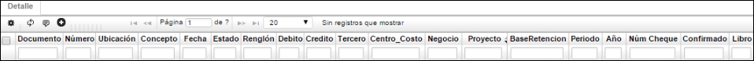

## Saldo Periódico Auxiliar Proyecto - KSPP

Esta aplicación nos permite visualizar los saldos periódicamente de los proyectos, se puede filtrar por año, cuenta, proyecto.

**Periodo:** Valor numérico que identifica al mes.  
**Año:** Año al cual se va a realizar la consulta.  
**Cuenta:** Identificación numérica y nombre de la cuenta.  
**Proyecto:** Identificación numérica del proyecto al cual pertenece la cuenta.  
**Debito:** Valor numérico de los movimientos débitos que se realizan durante el periodo.  
**Crédito:** Valor numérico de los movimientos créditos que se realizan durante el periodo.  
**Saldo:** Valor que tendrá la cuenta después de terminar el periodo.  

En el **Detalle** se encontrarán los siguientes campos:

**Documento:** Documentos que soportan el movimiento del maestro.  
**Numero:** Número de los documentos.  
**Ubicación:** Ubicación registrada para estos documentos.  
**Concepto:** Conceptos que se registraron para cada documento.  
**Fecha:** Fecha de registro de los documentos.  
**Estado:** Estado de los documentos, generalmente se encontrará en P de procesado.  
**Renglón:** Renglón del detalle del documento en el cual se registró la cuenta consultada en el maestro.  
**Débito:** Valor del documento si lo hay.  
**Crédito:** Valor del documento si lo hay.  
**Tercero:** Tercero asociado al documento.  
**Centro de costo:** Centro de costo asociado al documento.  
**Negocio:** Negocio asociado al documento.  
**Proyecto:** Proyecto asociado al documento.  
**Base de retención:** Base de retención del documento si aplica para la cuenta consultada en el maestro.  
**Periodo:** Periodo de registro del documento.  
**Año:** Año de registro del documento.  
**Núm Cheque:** número de cheque.  
**Libro:** Libro del documento.  

El **KSPP** permite visualizar totales en las columnas 'Anterior', 'Debito', 'Credito' y 'Saldo', con la finalidad de poder consultar los saldos acumulados por proyecto, (verde).  
Nos permite identificar cuando existen diferencias entre maestro y detalle descuadrando el modulo. (amarillo).  

