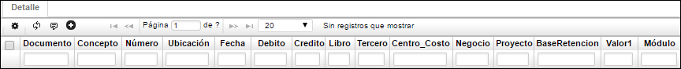

---

layout: default
title: Saldo Per. Aux. Tercero
permalink: /Operacion/erp/contabilidad/ksaldo/kspt
editable: si

---

## Saldo Periódico Auxiliar Tercero - KSPT

El objetivo de la aplicación Saldo Periódico Auxiliar **KSPT** es consultar los saldos del periodo filtrando por el número de tercero. 

**Periodo:** Valor numérico que hace referencia al mes.  
**Año:** Año en el cual se va a hacer la consulta.  
**Libro:** Número de libro según parametrización en Libros (KLIB).  
**Plan:** En este campo se colocará el código del plan del cual se tomarán las cuentas.  
**Cuenta:** Código que identifica a la cuenta.  
**Tercero:** Identificación numérica y nombre del tercero que puede ser un cliente, proveedor, entre otros.  
**Anterior:** Valor que tiene la cuenta al iniciar el periodo.  
**Débito:** Valor numérico de movimientos débitos realizados durante el periodo.  
**Crédito:** Valor numérico de movimientos créditos realizados durante el periodo.  
**Saldo:** Valor numérico con el que queda la cuenta después de finalizar el periodo.  

**Detalle**

**Documento:** Documentos que soportan el movimiento del maestro.  
**Concepto:** Conceptos que se registraron para cada documento.  
**Número:** Número de los documentos.  
**Ubicación:** Ubicación registrada para estos documentos.  
**Fecha:** Fecha de registro de los documentos.  
**Débito:** Valor del documento si lo hay.  
**Crédito:** Valor del documento si lo hay.  
**Libro:** Libro del documento.  
**Tercero:** Tercero asociado al documento.  
**Centro de costo:** Centro de costo asociado al documento.  
**Negocio:** Negocio asociado al documento.  
**Proyecto:** Proyecto asociado al documento.  
**Base de retención:** Base de retención del documento si aplica para la cuenta consultada en el maestro.  

