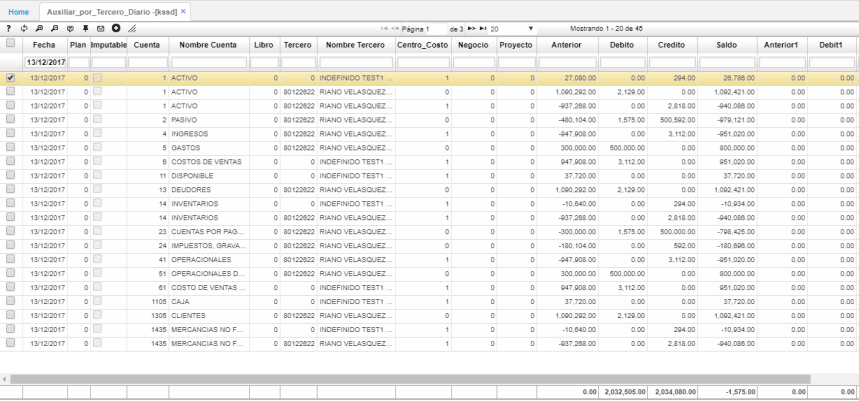

# KSSD - Auxiliar por tercero diario

La aplicación KSSD permite la visualización de los saldos diarios generados desde la aplicación [**KPSD - Saldos Diarios**](http://docs.oasiscom.com/Operacion/erp/contabilidad/kproceso/kpsd).  

Ingresamos a la aplicación y consultamos por la fecha en la que se generaron los saldos diarios.  

