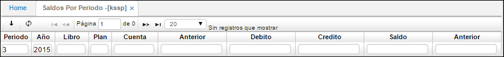
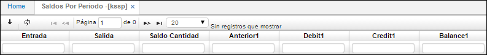
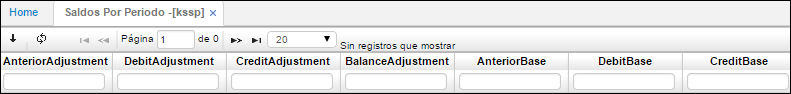
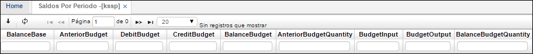
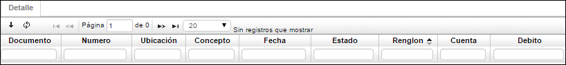

## SALDOS POR PERIODO - KSSP

En la aplicación Saldos por Periodo se puede verificar los saldos por cuenta, se pueden consultar filtrando por cuenta, periodo, año, también se verifica los movimientos débitos, créditos y saldos a la fecha.

**Periodo:** Identificación numérica del mes (periodo) en la cual se quiere observar la cuenta.  
**Año:** Año al cual se quiere hacer referencia.  
**Libro:** Número de libro según parametrización en Libros (klib).  
**Plan:** En este campo se colocará el código del plan del cual se tomarán las cuentas.  
**Cuenta:** Identificación numérica y nombre de la cuenta a consultar el saldo.  
**Anterior:** Valor numérico de la cuenta antes de iniciar el periodo.  
**Debito:** Valor numérico de movimientos debito realizados durante el periodo.  
**Crédito:** Valor numérico de movimientos crédito realizados durante el periodo.  
**Saldo:** Valor numérico con el que queda la cuenta al final del periodo.  
**Anterior:** Se refleja el valor antes de iniciar el periodo en la moneda que fue emitido el documento.  
**Entrada:** Se refleja el valor de los movimientos crédito realizados durante el periodo en la moneda que fue emitido el documento.  
**Salida:** Se refleja el valor de movimientos crédito realizados durante el periodo en la moneda que fue emitido el documento.  
**Saldo cantidad:** se refleja el valor con el que queda la cuenta al final del periodo en la moneda que fue emitido el documento.  

En la pestaña **DETALLE** se puede observar a que pertenece el saldo encontrado en el maestro.

**Documento:** Documentos que soportan el movimiento del maestro.  
**Numero:** Número de los documentos.  
**Ubicación:** Ubicación registrada para estos documentos.  
**Concepto:** Conceptos que se registraron para cada documento.  
**Fecha:** Fecha de registro de los documentos.  
**Estado:** Estado de los documentos, generalmente se encontrará en P de procesado.  
**Renglón:** Renglón del detalle del documento en el cual se registró la cuenta consultada en el maestro.  
**Débito:** Valor del documento si lo hay.  
**Crédito:** Valor del documento si lo hay.  
**Tercero:** Tercero asociado al documento.  
**Centro de costo:** Centro de costo asociado al documento.  
**Negocio:** Negocio asociado al documento.  
**Proyecto:** Proyecto asociado al documento.  
**Base de retención:** Base de retención del documento si aplica para la cuenta consultada en el maestro.  
**Periodo:** Periodo de registro del documento.  
**Año:** Año de registro del documento.  
**Libro:** Libro del documento.  

