---
layout: default
title: Conciliación con Prestadores  
permalink: /Operacion/erp/cuentas/pconciliac/pcon  
editable: si  
---  

# Conciliación con Prestadores - PCON  

Este manual mostrará el proceso para conciliar las tarjetas de crédito que tienen asociadas a los empleados.  

Para poder realizar el proceso de conciliación se debe tener en cuenta lo siguiente:  

* [**Parametrización**](http://docs.oasiscom.com/Operacion/erp/cuentas/pconciliac/pcon#parametrizacion)  
>+ [**BTER - Terceros**](http://docs.oasiscom.com/Operacion/erp/cuentas/pconciliac/pcon#bter---terceros)  
>+ [**BBAN - Bancos**](http://docs.oasiscom.com/Operacion/erp/cuentas/pconciliac/pcon#bban---bancos)  
>+ [**TBBC - Conceptos de Bancos**](http://docs.oasiscom.com/Operacion/erp/cuentas/pconciliac/pcon#tbbc---conceptos-de-bancos)  
>+ [**BUBI - Ubicación Organización**](http://docs.oasiscom.com/Operacion/erp/cuentas/pconciliac/pcon#bubi---ubicación-organización)  
>+ [**BGRU - Grupo contable**](http://docs.oasiscom.com/Operacion/erp/cuentas/pconciliac/pconbgru---grupo-contable)  
>+ [**BDOC - Documentos**](http://docs.oasiscom.com/Operacion/erp/cuentas/pconciliac/pconbdoc---documentos)  
>+ [**BPLA - Plantillas**](http://docs.oasiscom.com/Operacion/erp/cuentas/pconciliac/pconbpla---plantillas)  
>+ [**BINT - Interfaces**](http://docs.oasiscom.com/Operacion/erp/cuentas/pconciliac/pcon#bint---interfaces)  
>+ [**PCON - Conciliación**](http://docs.oasiscom.com/Operacion/erp/cuentas/pconciliac/pconpcon---conciliación)

* [**PROCESO**](http://docs.oasiscom.com/Operacion/erp/cuentas/pconciliac/pcon#proceso)  
>+ [**PCON - Conciliación**](http://docs.oasiscom.com/Operacion/erp/cuentas/pconciliac/pcon#pcon---conciliación)  
>+ [**BINT - Interfaces**](http://docs.oasiscom.com/Operacion/erp/cuentas/pconciliac/pcon#bint---interfaces)  
>+ [**PCON - Conciliación**](http://docs.oasiscom.com/Operacion/erp/cuentas/pconciliac/pconpcon---conciliación)  

## [**Parametrización**](http://docs.oasiscom.com/Operacion/erp/cuentas/pconciliac/pcon#parametrizacion)  

La parametrización sólo se debe realizar una sola vez para todo el proceso y es la siguiente:  

### [**BTER - Terceros**](http://docs.oasiscom.com/Operacion/erp/cuentas/pconciliac/pcon#bter---terceros)  
La parametrización requerida para esta aplicación es que a cada uno de los empleados se les debe asociar el centro de costo, proyecto y tarjeta de crédito correspondiente:   

 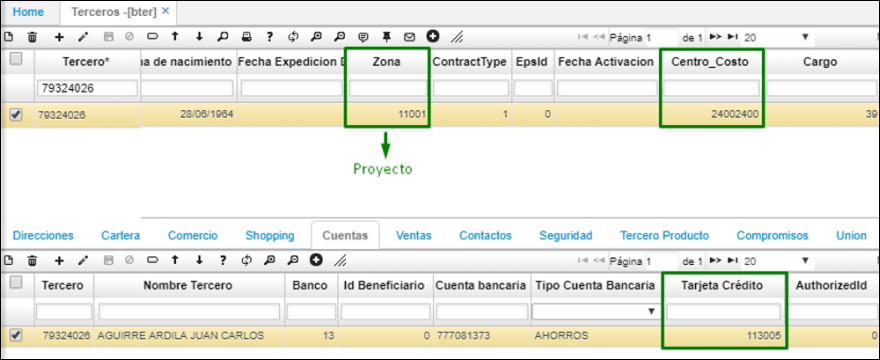  

### [**BBAN - Bancos**](http://docs.oasiscom.com/Operacion/erp/cuentas/pconciliac/pcon#bban---bancos)  
Se creó el banco 801 para tarjetas de crédito el cual en el código externo debe tener 1130 el cual es la ubicación padre de las tarjetas de crédito:  

 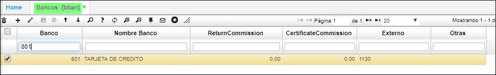  

### [**TBBC - Conceptos de Bancos**](http://docs.oasiscom.com/Operacion/erp/cuentas/pconciliac/pcon#tbbc---conceptos-de-bancos)  
Una vez se crea el banco se debe realizar la parametrización en la aplicación TBBC en donde se le indica al sistema que códigos del banco corresponde a que documentos del sistema OasisCom y si deben generar el documento automáticamente.  
 
  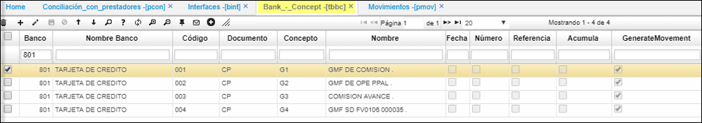  

### [**BUBI - Ubicación Organización**](http://docs.oasiscom.com/Operacion/erp/cuentas/pconciliac/pcon#bubi---ubicación-organización)  
La parametrización requerida para esta aplicación es diligenciar las tarjetas de crédito con su respectivo empleado:  

  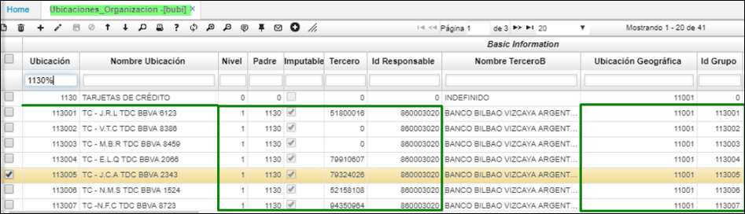  

### [**BGRU - Grupo contable**](http://docs.oasiscom.com/Operacion/erp/cuentas/pconciliac/pconbgru---grupo-contable)  
En la ubicación se debe asociar el grupo contable correspondiente, el cual debe tener asociado en el detalle el código CMP y la cuenta contable de la tarjeta de crédito:  
  
   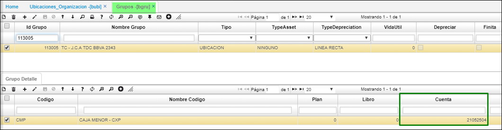  
### [**BDOC - Documentos**](http://docs.oasiscom.com/Operacion/erp/cuentas/pconciliac/pconbdoc---documentos)  
Así mismo se debe tener presente la parametrización de los conceptos de gravámenes financieros y deben tener creado su respectivo motivo.  

 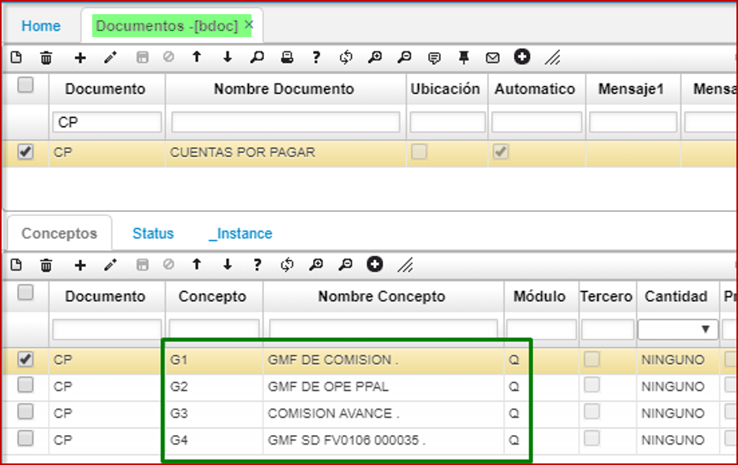  

### [**BPLA - Plantillas**](http://docs.oasiscom.com/Operacion/erp/cuentas/pconciliac/pconbpla---plantillas)  
Una vez se crean los conceptos y motivos, se debe parametrizar la plantilla por cada uno de los conceptos con las cuentas sugeridas:  
    

## [**PROCESO**](http://docs.oasiscom.com/Operacion/erp/cuentas/pconciliac/pcon#proceso)  

Una vez se ha realizado toda la parametrización nombrada anteriormente se puede iniciar con el proceso para realizar la conciliación de las tarjetas de crédito.  

Se deben registrar todos los movimientos correspondientes a las tarjetas durante el mes actual  

### [**PCON - Conciliación**](http://docs.oasiscom.com/Operacion/erp/cuentas/pconciliac/pcon#pcon---conciliación)  

Se debe crear un maestro con la siguiente información:  
-	Documento: KP   
-	Ubicación: Ubicación de la tarjeta de crédito a conciliar  
-	Fecha original: Fecha de inicio del rango de conciliación  
-	Fecha: Fecha final del rango de conciliación  
-	Concepto: KP  
-	Tercero: NIT del tercero del banco  

 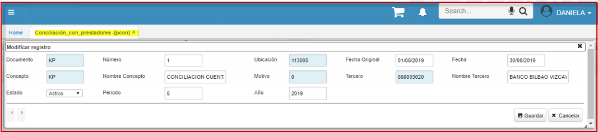  

Allí podrán identificar que en la pestaña “Libros” el sistema arroja todos los movimientos realizados en ese rango de fechas y asociados a esa tarjeta de crédito (ubicación).   

### [**BINT - Interfaces**](http://docs.oasiscom.com/Operacion/erp/cuentas/pconciliac/pcon#bint---interfaces)  

Una vez se encuentra creado el maestro de la aplicación **PCON** se procede a cargar el extracto de la tarjeta de crédito, recordemos que este archivo debe estar parametrizado en el BARC de acuerdo con la estructura correspondiente:  

  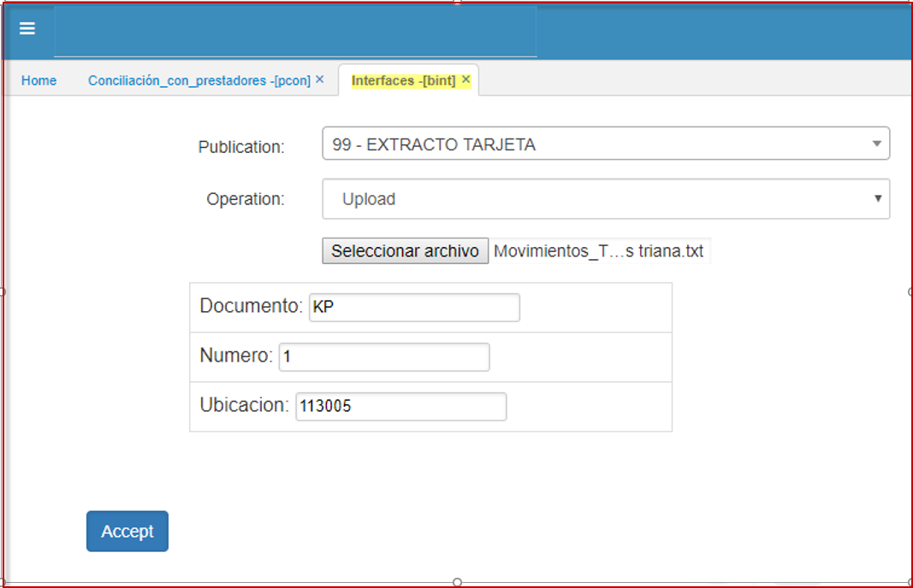  

Allí se debe seleccionar la publicación 99, el archivo en txt correspondiente y se debe asociar el documento, número y ubicación creadas anteriormente.  

### [**PCON - Conciliación**](http://docs.oasiscom.com/Operacion/erp/cuentas/pconciliac/pconpcon---conciliación)   

Una vez se carga el extracto de la tarjeta de crédito se valida nuevamente el **PCON** en donde se identifica que la pestaña “Proveedor” el sistema carga el extracto  

  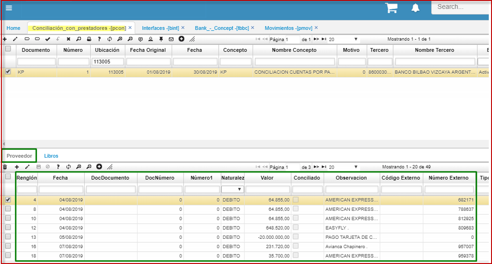  

Posterior a la validación del cargue se debe ejecutar el icono de generar movimientos  

  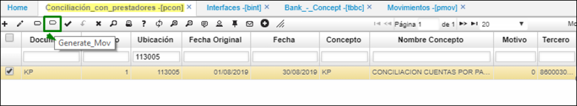  

Cuando se ejecuta el botón el sistema crea en la aplicación **PMOV** todos los documentos de gravamen financiero, los cuales se deben validar y procesar:  

  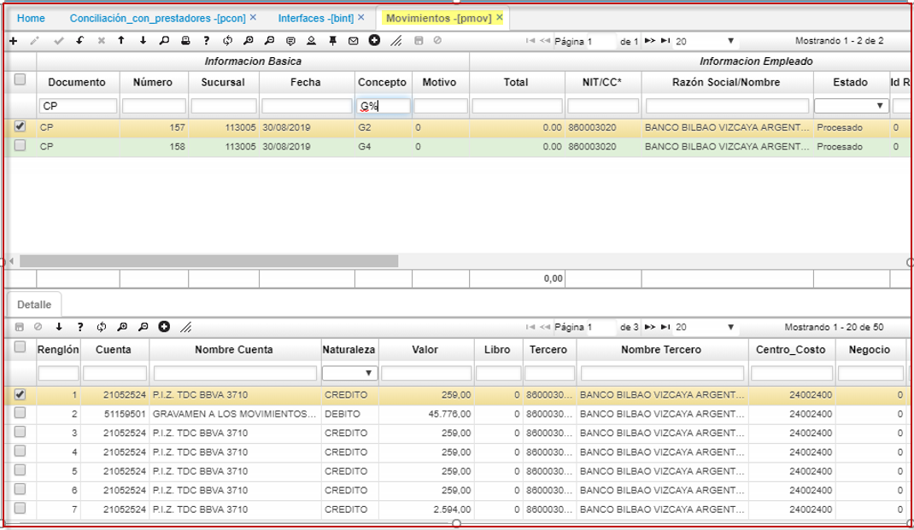  

Una vez se procesan los documentos en **PMOV** nuevamente se ingresa a **PCON** y se ejecuta el botón de “Conciliación Automática”, allí el sistema conciliará lo que coincida en fecha y valor entre bancos y libros.  

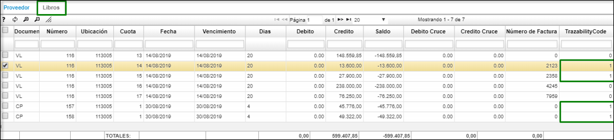  

  
