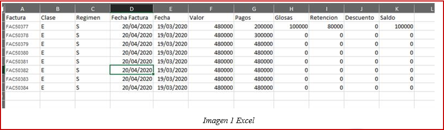
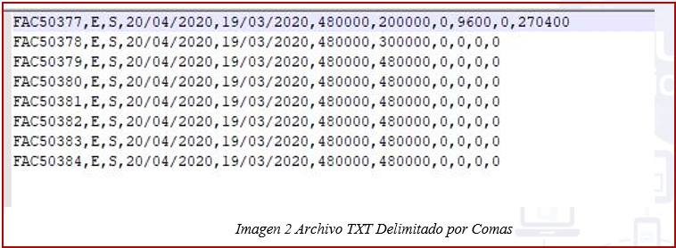
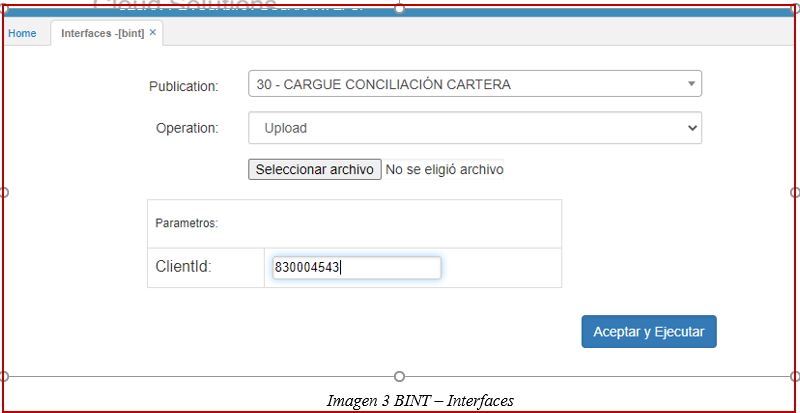
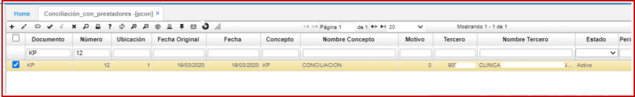
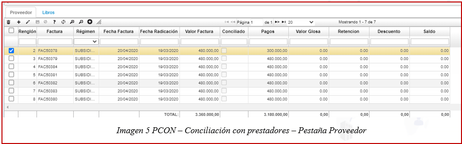
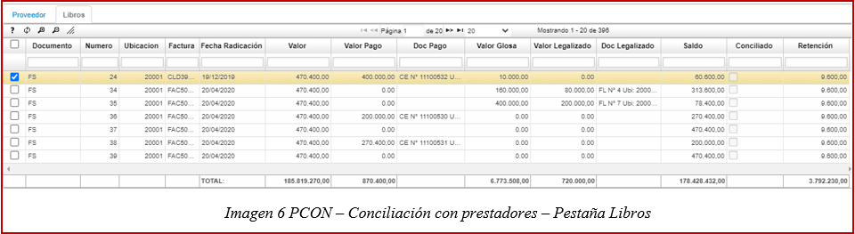
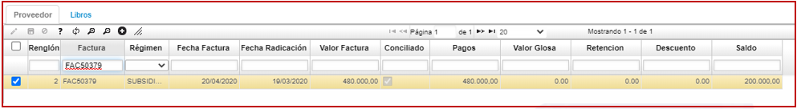
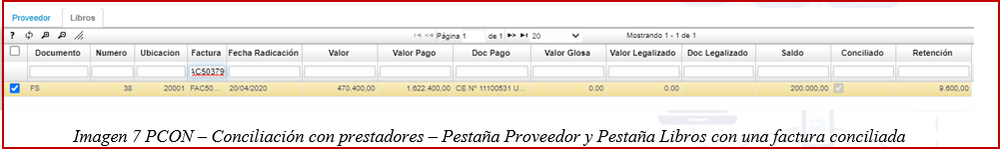
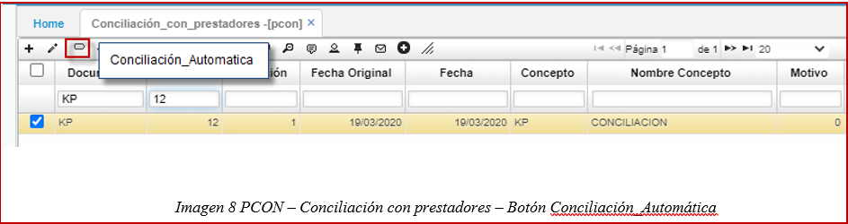
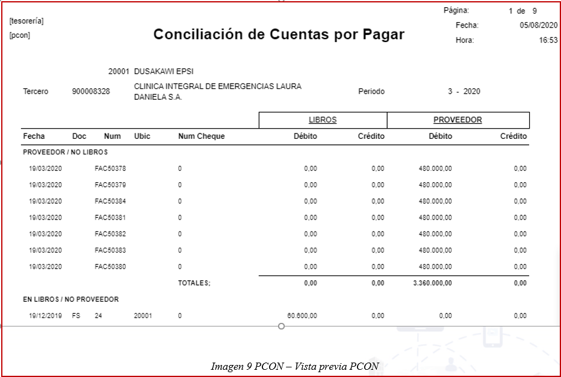

# Conciliación  

Este submódulo permite realizar el proceso para conciliar las tarjetas de crédito que se tienen asociadas a los empleados.  

La aplicación que se utiliza es:  

* [**PCON**](http://docs.oasiscom.com/Operacion/erp/cuentas/pconciliac/pcon)  - Conciliación con prestadores

*  Conciliación con Proveedores: 

1.	CONCILIACIÓN PROVEEDORES

Para llevar a cabo la conciliación de proveedores en la aplicación OASISCOM se debe realizar el siguiente proceso:  

El archivo Excel debe tener la estructura que se relaciona en la siguiente imagen, y una vez recibido el archivo por el proveedor debe ser guardado como TXT, delimitado por comas.  

  

  

Ingresamos a la opción bint (interfaces) y bajo la publicación #30 CARGUE CONCILIACIÓN CARTERA, se sube el archivo plano del proveedor y se digita en el campo ClientId el numero NIT del proveedor, seguido del botón Aceptar y Ejecutar.  

  

Se ingresa a la opción PCON Conciliación con prestadores, se consulta bajo documento KP (CONCILIACION CXP), concepto KP (CONCILIACION), y el numero NIT del proveedor, el movimiento creado automáticamente en estado ACTIVO.   

  

En la pestaña PROVEEDOR, el sistema relaciona la información contenida en el archivo plano del proveedor.  

  
En la pestaña LIBROS, el sistema relaciona los movimientos que a la fecha de conciliación tienen saldo.   

  

Si al momento de la carga y creación automática del documento KP, el sistema encuentra registros que concilian, en la pestaña Proveedor, con la pestaña Libros, los registros se marcaran con chek en la columna CONCILIADO.  

  
  

Si en el momento de la conciliación se identifican registros dentro del sistema que no han sido cruzados, y se realiza el movimiento, para actualizar la información de la pestaña Libros, se debe ejecutar el botón Conciliación_Automatica, que se encuentra en la parte superior de la aplicación PCON.  

  

Una vez terminada la conciliación con el proveedor se procede a procesar el movimiento KP y desde la vista preliminar se obtiene el certificado de conciliación.  

  

