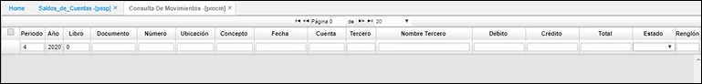

# Consulta de Movimientos - PMCM

En esta aplicación se encuentran los movimientos que ha tenido el periodo en el módulo Cuentas por Pagar. Resume los movimientos realizados por empresa, con la respectiva causación.

Esta consulta se puede efectuar por diferentes parámetros de búsqueda (Documento, Número, Ubicación, Concepto, Fecha, Total, Cuenta, Naturaleza, Valor, Tercero, Centro de costo, Estado).  

**Documento:** Tipo de documento.  
**Número:** El sistema asigna automáticamente el consecutivo de cada documento, según las especificaciones otorgadas al documento en la opción BCNS.  
**Ubicación:** Ubicación organizacional que genero el documento.  
**Concepto:** Código del Concepto por el cual se hace el movimiento. Este define automáticamente la afectación contable del movimiento, por tanto debe estar perfectamente definido.  
**Fecha:** Fecha en que se realiza el movimiento.  
**Tercero:** Identificación numérica del tercero a consultar.  
**Cuenta:** Cuenta contable donde reside la operación.  
**Total:** Monto total del movimiento.  
**Estado:** Estado del documento (Activo, Procesado y Anulado).  
**Renglón:** Consecutivo que se genera cuando se manejan varias cuentas en un comprobante.  

