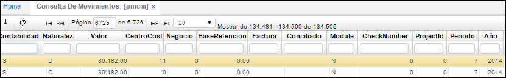

# Consulta de Movimientos - PMCM

La consulta de movimientos permite consultar los movimientos que se realizan en el módulo, la consulta se puede realizar por diferentes parámetros de búsqueda (Documento, Número, Ubicación, Concepto, Fecha, Total, Cuenta, Naturaleza, Valor, Tercero, Centro de costo, Estado).  

**Documento:** Tipo de documento.  
**Número:** El sistema asigna automáticamente el consecutivo de cada documento, según las especificaciones otorgadas al documento en la opción BCNS.  
**Ubicación:** Ubicación organizacional que genero el documento.  
**Concepto:** Código del Concepto por el cual se hace el movimiento. Este define automáticamente la afectación contable del movimiento, por tanto debe estar perfectamente definido.  
**Fecha:** Fecha en que se realiza el movimiento.  
**Tercero:** Identificación numérica del tercero a consultar.  
**Cuenta:** Cuenta contable donde reside la operación.  
**Total:** Monto total del movimiento.  
**Estado:** Estado del documento (Activo, Procesado y Anulado).  
**Renglón:** Consecutivo que se genera cuando se manejan varias cuentas en un comprobante.  

**Naturaleza:** Naturaleza de la cuenta (débito o crédito).  
**Valor:** Valor actual de la obligación.  
**Centro Costo:** Identificación numérica del centro de costo al cual pertenece la cuenta.  
**Negocio:** Identificación numérica del negocio.  
**Base Retención:** Valor que se toma como base para liquidar la retención que se le aplica a un concepto.  
**Factura:** Número de factura registrada en el documento.  
**Check Number:** Identificación del cheque, se utiliza cuando la forma de pago de la obligación es en cheque.  
**Projectld:** Identificación numérica del proyecto.  
**Periodo:** Mes en el que se encuentra registrado el movimiento.  
**Año:** Identificación numérica del proyecto.  

