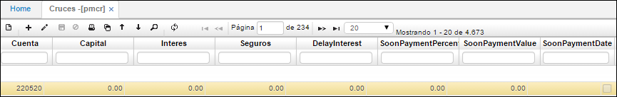
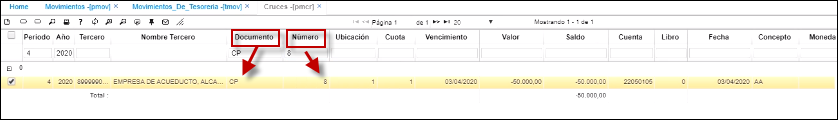
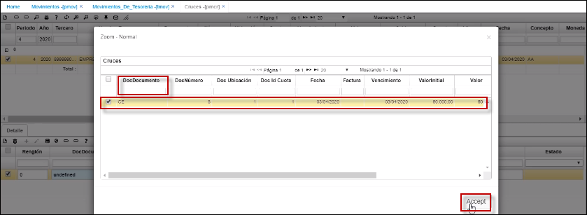
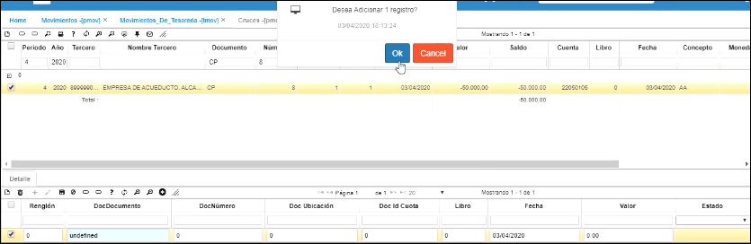
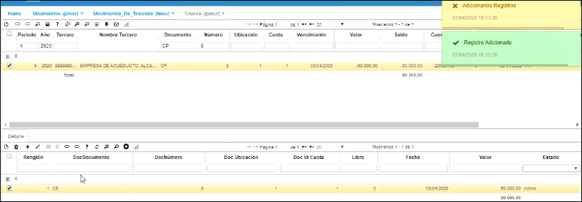
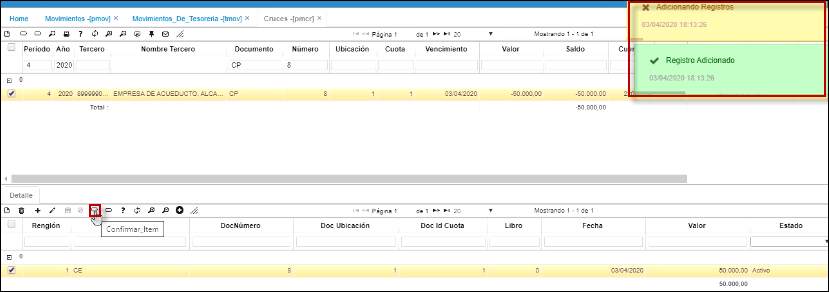
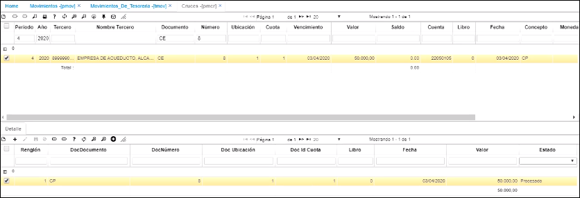

# Cruces - PMCR

**Entrada:** La entrada de datos a esta aplicación provienen de la aplicación pmov (movimientos) que resultan de movimientos generados con documentos como: comprobantes de egreso, cuentas por pagar, notas crédito, recibos de caja entre otros.  

En esta aplicación, usted podrá ver cómo se realiza el proceso:  

* [**Cómo realizar el Cruce con las cuentas por pagar**](http://docs.oasisCom/Docs/edit/master/Operacion/erp/cuentas/pmovimient/pmcr#cómo-realizar-el-cruce-con-las-cuentas-por-pagar)

**Proceso:** El proceso que se realiza en esta aplicación es el de cruzar los diferentes documentos que provienen de la aplicación pmov (movimientos), el proceso consiste en buscar el documento que genere la contrapartida del otro para posteriormente confirmarlo y así  saldar el documento que se encuentra pendiente. Al causar los documentes pendientes se actualizan los saldos de las cuentas de los terceros con los que la empresa tiene obligaciones.  

**Salida:** Los datos de salida de este proceso se observan en las consultas de los saldos de las cuentas de los terceros, en los reportes  de cuenta de los terceros en el reporte de cruces que presenta el módulo de cuentas por pagar.  

**Periodo:** Periodo o mes en el que se va a realizar el cruce.  
**Año:** Año en el que se va a realizar el cruce.  
**Tercero:** Identificación numérica del tercero al que se le realizará el cruce.  
**Documento:** Son los documentos que se han creado para ser utilizados en el módulo de cuentas por pagar, tan Notas Débito, Notas Crédito, Comprobantes de Egreso y Cuentas por Pagar.  
**Número:** Numero con el cual se generó el documento.  
**Ubicación:** Identificación de la ubicación de un punto de la empresa.  
**Cuota:** Número de la cuota, en caso de pactarse pagos por cuotas.  
**Fecha:** Fecha en la que se realiza el cruce.  
**Vencimiento:** Fecha en la que se realiza el cruce.  
**Valor:** Monto total de la deuda.  
**Saldo:** Valor actual de la obligación.  
**Saldo cuentas:** Diferencia entre el valor y el saldo.  
**Cuenta:** Identificación numérica de las cuentas afectadas, asignada según PUC.  

**Intereses:** Valor de intereses.  
**Delay Interest:** Valor por intereses de mora.  
**Soon Payment Percentage:** Porcentaje equivalente al pronto pago sobre el valor total.  
**Soon Payment Value:** Valor correspondiente al pronto pago.  
**Soon Payment Date:** Fecha en la que se realizará el pronto pago.  

**Pago:** Marcar si la obligación ya fue pagada.  
**PaymentValue:** Valor del pago realizado o recibido.  
**Moneda:** Tipo de moneda en la cual se hace el movimiento.  
**Plan:** En este campo se colocara el código del plan del cual se tomaran las cuentas.  
**Factura:** Número de factura a la cual se le realizará el cruce.  
**Concepto:** Concepto del documento al que se realizará el cruce.  
**Naturaleza:** Hace referencia a la naturaleza de la cuenta si es débito o crédito.  
**Invoice Number:** Valor de la factura a la que se le realizará el cruce.  

Esta aplicación cuenta con un detalle en donde se pueden identificar los documentos que se han cruzado con el documento original que se encuentra en el maestro, se especifican los siguientes campos:  

**Renglón:** Consecutivo generado que se manejan en el comprobante.  
**Doc Documentld:** Tipo de documento al que se le realizará el cruce.  
**Doc Numberld:** Número del documento al que se le realizará el cruce.  
**Doc Locationld:** Ubicación en la que se encuentra el documento al que se le realizará el cruce.  
**Doc Quotald:** Número de cuotas a las que está el documento.  
**Fecha:** Fecha en la que se realiza el cruce.  
**Valor:** Valor por el cual se realizará el cruce.  
**Estado:** Estado del documento (Activo, Procesado, Anulado).  

## [**Cómo realizar el Cruce con las cuentas por pagar**](http://docs.oasisCom/Docs/edit/master/Operacion/erp/cuentas/pmovimient/pmcr#cómo-realizar-el-cruce-con-las-cuentas-por-pagar)  

Se consulta la cuenta por pagar: en este caso, vamos a darle continuidad al proceso de la aplicación **PMOV** [Causación de Cuentas por pagar](http://docs.oasiscom.com/Operacion/erp/cuentas/pmovimient/pmov#causación-de-cuentas-por-pagar).  En el campo **_Documento_** se elige la opción **CP** de Cuenta por pagar y en el campo **_Número_** el número de la cuenta por pagar que en este caso es la **_8_**  

  

En la parte inferior, en el detalle, adicionamos un registro (+); en el campo **_DocDocumento_**, hacemos doble clic y el sistema nos va a relacionar con qué movimiento tipo egreso podemos cruzar la factura y en este caso, elegimos el egreso que acabamos de registrar, guardamos y el sistema nos inserta el registro del cruce.

  
  

Finalmente, se procede a confirmar el cruce  

Lo podemos validar desde la cuenta por pagar y para verlo más efectivo, desde el egreso número 8 también se va a ver identificado que el cruce quedó ejecutado correctamente.  De esta manera, se registran los cruces manuales desde esta opción **PMCR** y se hace la causación de cuentas por pagar desde la opción **PMOV - Movimientos**.  

