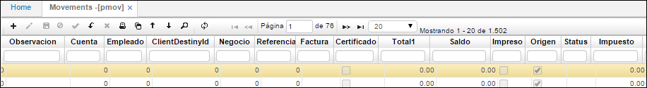
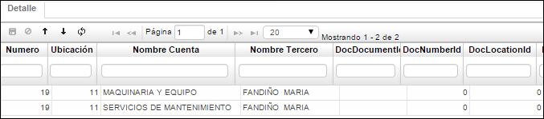
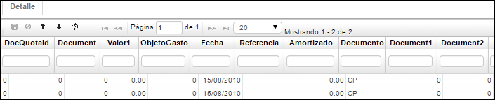
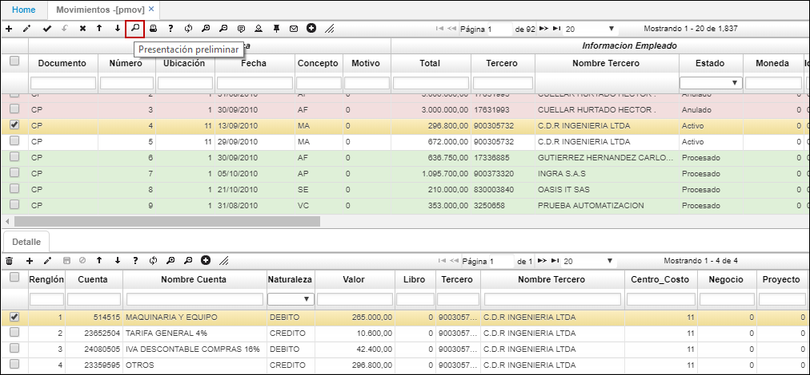
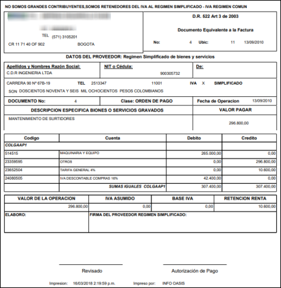
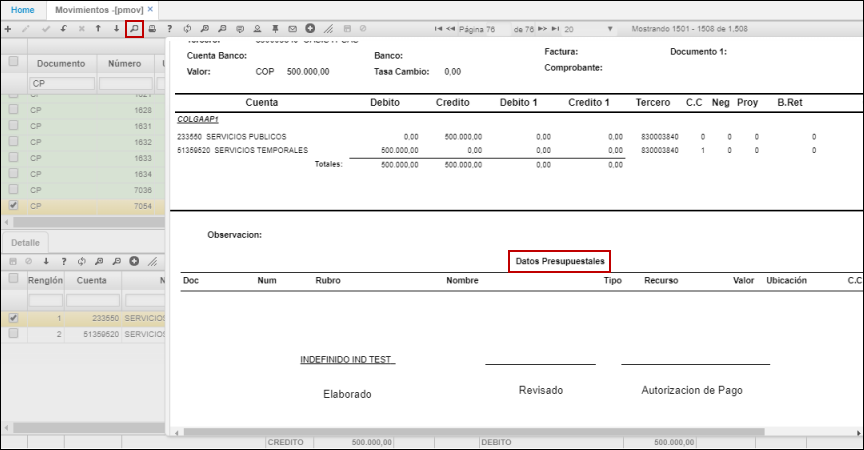
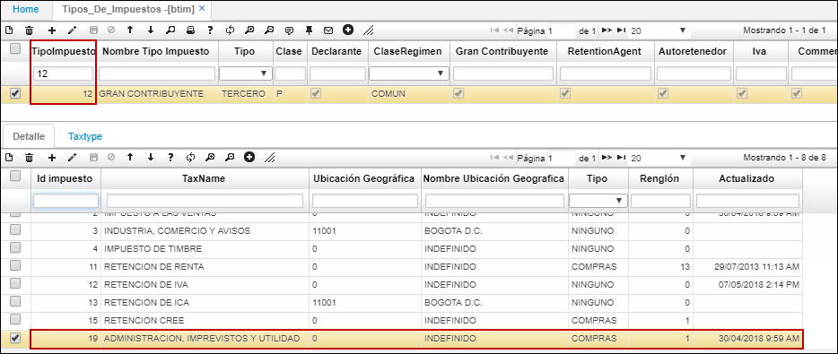
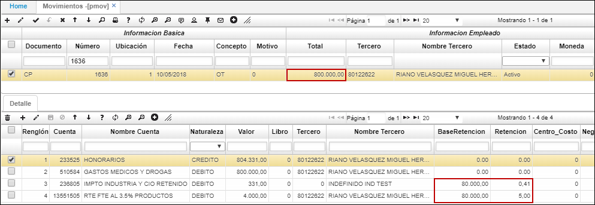

# Movimientos - PMOV

Las operaciones del módulo de Cuentas por Pagar en su gran mayoría se ejecutan por la aplicación movimientos, 

Los siguientes procesos se encuentran documentados en esta aplicación:  

>+ [Documento equivalente](http://docs.oasiscom.com/Operacion/erp/cuentas/pmovimient/pmov#documento-equivalente)
>+ [Vista previa con información presupuestal](http://docs.oasiscom.com/Operacion/erp/cuentas/pmovimient/pmov#vista-previa-con-información-presupuestal)
>+ [Causaciones con AIU - Administración, Imprevistos y Utilidad](http://docs.oasiscom.com/Operacion/erp/cuentas/pmovimient/pmov#causaciones-con-aiu---administración-imprevistos-y-utilidad)
>+ [Proceso de Causación](http://docs.oasiscom.com/Operacion/erp/cuentas/pmovimient/pmov#proceso-de-causación)
>+ [Prestaciones económicas](http://docs.oasiscom.com/Operacion/erp/cuentas/pmovimient/pmov#prestaciones-economicas)

**Documento:** Son los documentos que se han creado para ser utilizados en el módulo de cuentas por pagar, tan Notas Débito, Notas Crédito, Comprobantes de Egreso y Cuentas por Pagar.  
**Número:** El sistema asigna automáticamente el consecutivo de cada documento, según las especificaciones otorgadas al documento en la opción BCNS.  
**Ubicación:** Ubicación que efectúa el movimiento o al que se le aplica el movimiento, en caso de que la empresa tenga centralizado el manejo de la información.  
**Fecha:** Fecha en la cual se realiza el movimiento. Es importante puesto que es la misma fecha de la afectación contable.  
**Concepto:** Código del Concepto por el cual se hace el movimiento. Este define automáticamente la afectación contable del movimiento, por tanto debe estar perfectamente definido.  
**Motivo:** Número que identifica un documento para casos especiales a nivel contable, se puede parametrizar los documentos por conceptos en la aplicación BDOC, los motivos se parametrizan desde la aplicación BPLA.  
**Total:** Valor total del movimiento.  
**Tercero:** Código del tercero que es afectado con el presente movimiento. Todos los movimientos deben tenerlo. La cuenta contable del tercero complementa la afectación contable.  
**Nombre Tercero:** Nombre del tercero al cual afecta el movimiento.  
**Estado:** Estado del documento (Activo, Procesado y Anulado).  
**Moneda:** Campo que indica el tipo de moneda a manejar en la generación de los movimientos.  
**Comprobante Fiscal:** ingresar el número de comprobante fiscal.  

**Observación:** Observación que se desee hacer sobre el documento a registrar.  
**Cuenta:** Identificación numérica de la cuenta afectada.  
**Empleado:** Identificación numérica del empleado enacargado de generar el movimiento.  
**ClientDestinyld:** Identificación numérica del cliente a quien se destina el movimiento.  
**Negocio:** Identificación numérica del negocio.  
**Factura:** Número de la factura o documento que se está registrando.  
**Total1:** Valor total en la moneda que se realiza el movimiento.  
**Saldo:** Valor total del movimiento.  
**Impreso:** Se selecciona cuando el documento ya ha sido impreso.  
**Centro de costo:** Ingresar el centro de costo correspondiente al documento que se registra. Los centros de costo se parametrizan en la aplicación [**BUBI - Básico de ubicaciones**](http://docs.oasiscom.com/Operacion/common/borgan/bubi).  

El detalle especifica las cuentas contables que se están afectando con el movimiento u operación, su naturaleza, valor, centro de costo, base de retención, etc.  

**Renglón:** Consecutivo que se genera cuando se manejan varias cuentas en un comprobante.  
**Cuenta:** Identificación numérica de la cuenta.  
**Naturaleza:** Naturaleza de la cuenta (débito o crédito).  
**Valor:** Valor numérico que tiene la cuenta.  
**Tercero:** Identificación numérica del tercero.  
**Centro Costo:** Identificación del centro de costo al que pertenece la cuenta.  
**Negocio:** Identificación numérica del negocio.  
**Projectld:** Identificación numérica del proyecto.  
**BaseRetención:** Valor que se toma como base para liquidar la retención que se le aplica a un concepto.  
**Retención:** Valor de retención.  

**Número:** Consecutivo del documento (PMOV) asignado.  
**Ubicación:** Ubicación organizacional que genero el documento.  
**Nombre cuenta:** Nombre de la cuenta correspondiente según PUC.  
**Nombre tercero:** Nombre del tercero al que afecta el movimiento.  
**DocDocumentld:** Documento relacionado con la cuenta por pagar.  
**DocNumberld:** Número del documento relacionado con la cuenta por pagar.  
**DocLocationld:** Ubicación del documento relacionado con la cuenta por pagar.  

**Valor1:** Hace referencia al tipo de moneda origen en que se realizan determinados movimientos.  
**Fecha:** Fecha en que se realiza el movimiento.  
**Amortizado:** Número de veces que se amortizará el movimiento.  
**Documento:** Tipo de documento registrado.  

* * Otro formato del PMOV en su vista prelimanar se visualizara asi al exportar a PDF, donde se totalizan sus valores por cada uno de sus libros.  

## [Documento equivalente](http://docs.oasiscom.com/Operacion/erp/cuentas/pmovimient/pmov#documento-equivalente)

Este formato tiene como finalidad cumplir con las normas de ley que debe contener el documento y a su vez incluir las empresas que que asumen la retencion de ICA y fuente para el mismo.  

Para definir el formato de Documento Equivalente en algún documento de la aplicación PMOV, previamente se debe realizar la parametrización en la aplicación [**SPRO - Programas**](http://docs.oasiscom.com/Operacion/cloud/smetadata/spro#parametrizaci%C3%B3n-de-formatos-de-impresi%C3%B3n), en donde consultaremos el número de formato (_Ver aplicación_). Seguidamente, continuar con la parametrización correspondiente en [**BDOC - Documentos**](http://docs.oasiscom.com/Operacion/common/bsistema/bdoc#parametrizaci%C3%B3n-de-formatos-de-impresi%C3%B3n) en donde asingaremos el formato el documento (_Ver aplicación_).  

Asignado el formato al documento de la aplicación PMOV, seleccionamos el registro del maestro y damos click en el botón _presentación preliminar_ de la barra de herramientas.  

El documento equivalente puede ser extraído en formato de Excel, PDF o Word.  

## [Vista previa con información presupuestal](http://docs.oasiscom.com/Operacion/erp/cuentas/pmovimient/pmov#vista-previa-con-información-presupuestal)

Esta vista previa permite visualizar la información de la cuenta por pagar y adicionalmente conocer la afectación presupuestal.  

Para realizar la parametrización de este formato primero debemos ingresar a la aplicación [**SPRO - Programas**](http://docs.oasiscom.com/Operacion/cloud/smetadata/spro#parametrizaci%C3%B3n-de-formatos-de-impresi%C3%B3n) para consultar el Id del formato presupuestal y asignarlo al documento CP. (_Ver aplicación SPRO_).  

Realizada la parametrización, al seleccionar un registro de documento **CP** en la aplicación **PMOV** y dar click en el botón _Vista preliminar_ podremos ver la afectación de la cuenta por pagar a nivel contable y en la parte inferior la afectación presupuestal.  

## [Causaciones con AIU - Administración, Imprevistos y Utilidad](http://docs.oasiscom.com/Operacion/erp/cuentas/pmovimient/pmov#causaciones-con-aiu---administración-imprevistos-y-utilidad)

El proceso de causaciones con Administración, Imprevistos y Utilidad, tiene la finalidad de realizar el cálculo de impuestos para los servicios que lo requieran.

#### Parametrización

Para este proceso se debe inicialmente crear un impuesto tipo AIU en la aplicación [**BIMP - Impuestos**](http://docs.oasiscom.com/Operacion/common/bimpu/bimp).  

En el detalle se debe agregar un renglón por cada porcentaje de impuesto.  

Seguidamente, tendremos que relacionar el anterior impuestos a un grupo de impuesto en la opción [**BTIM - Tipos de Impuestos**](http://docs.oasiscom.com/Operacion/common/bimpu/btim).  

Relacionamos el impuesto _19 Administración, imprevistos y utilidad_ al tipo de impuesto correspondiente.  

En el campo _Renglón_ del detalle debemos traer el número del renglón que corresponda al porcentaje que se requiere asociar. En el anterior ejemplo asociamos el renglón **1** equivalente a **AIU 10%**.  

**_Nota:_** Se debe tener en cuenta que para movimientos del producto ERP (Financiero) el sistema tomará el impuesto de acuerdo con el tercero y para movimientos del producto SCM (Logística) el sistema tomará el impuesto de acuerdo con el producto.  

## [Proceso de Causación](http://docs.oasiscom.com/Operacion/erp/cuentas/pmovimient/pmov#proceso-de-causación)

Ahora procedemos a realizar en PMOV la causación de un servicio con impuesto _AIU Administración, Imprevistos y Utilidad_.  

Como la causación se realizará a un servicio correspondiente a ERP, en la aplicación **BTER - Terceros**, el tercero debe tener asignado el tipo de impuesto.  

En PMOV, creamos la causación de la cuenta por pagar, en el siguiente ejemplo está por un valor de $800.000.  

En el detalle, podemos ver que tomó como base de retención $80.000, es decir, el 10% de $800.000. Recordando que asignamos el renglón **1** correspondiente a **AIU 10%**

Finalmente procesamos el movimiento.  

## [Prestaciones económicas](http://docs.oasiscom.com/Operacion/erp/cuentas/pmovimient/pmov#prestaciones-economicas)

En la aplicación **PMOV,** en los campos de *DocDocumento, DocNúmero y DocUbicación,* se colocan los datos del **ELIP.** 

Al consultarlo, va a presentar la información de la contabilización del movimiento, ya confirmado. 

En la aplicación [PMCR](http://docs.oasiscom.com/Operacion/erp/cuentas/pmovimient/pmcr) se ve el registro para el pago. 

