## Orden de Pago - PORD

Aplicación que permite consultar las cuentas que están pendientes por pagar e igualmente permite confirmar la orden de pago de cada una de ellas. Contiene los siguientes campos:

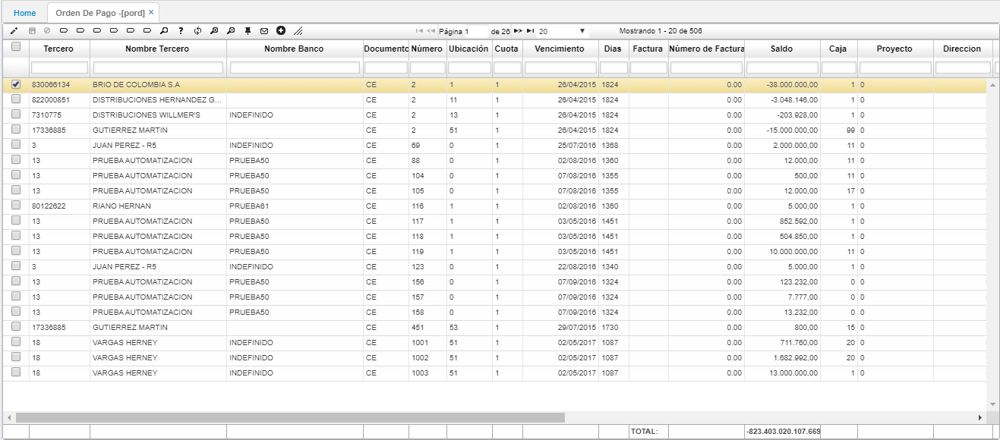

**Tercero:** Identificación del cliente, empleado o  tercero en general que presente saldo en cuentas por pagar.  
**Nombre Tercero:** Nombre del cliente, empleado o  tercero en general que presente saldo en cuentas por pagar.  
**Documento:** Hace referencia al tipo de comprobante.  
**Número:** Número con el cual se generó el comprobante.  
**Ubicación:** Identificación de la ubicación de un punto de la empresa.  
**Cuota:** Número de cuotas de la orden de pago.  
**Vencimiento:** Fecha de vencimiento de la orden de pago.  
**Días:** Días de vencimiento de la orden de pago.  
**Factura:** Factura a pagar.  
**Invoice Number:** Valor de la factura a pagar.  
**Saldo:** Saldo pendiente por pago. 

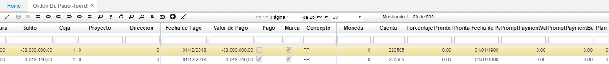

**Payment Date:** Fecha de pago de la Orden de Pago.  
**Payment Value:** Valor de pago de la Orden de Pago.  
**Pago:** Se marca si se realizó el pago.  
**Concepto:** Código del Concepto por el cual se hace el movimiento. Este define automáticamente la afectación contable del movimiento, por tanto debe estar perfectamente definido.  
**Moneda:** Campo que indica el tipo de moneda a manejar en la generación de los movimientos.  
**Cuenta:** Identificación numérica de las cuentas afectadas.  
**Prompt Payment Percentage:** Porcentaje que se pagará de la obligación.  
**Prompt Payment Date:** Fecha para el pronto pago de la obligación.  
**Prompt Payment Value:** Valor que se pagará de la obligación.  
**Plan:** En este campo se colocara el código del plan del cual se tomaran las cuentas.  

Para visualizar un registro sobre la aplicación **PORD**, se debió primero haber procesado la cuenta por pagar correspondiente en [**PMOV - Movimientos Cuentas por Pagar**](https://github.com/OasisCom/Docs/blob/master/Operacion/erp/cuentas/pmovimient/pmov.md).  

**Nota:** Es importante que la cuenta que utilizaremos en la aplicación [**PMOV - Movimientos Cuentas por Pagar**](https://github.com/OasisCom/Docs/blob/master/Operacion/erp/cuentas/pmovimient/pmov.md)  tenga parametrizado en la aplicación [**BCUE - Cuentas**]() el campo _Módulo_ con la letra **“P”** que hace referencia al módulo Cuentas por Pagar.  

Al procesar el movimiento de cuentas por pagar en la aplicación [**PMOV - Movimientos Cuentas por Pagar**](https://github.com/OasisCom/Docs/blob/master/Operacion/erp/cuentas/pmovimient/pmov.md), éste se verá reflejado en la aplicación **PORD** donde se realizará la confirmación de la orden de pago. Se consulta por número de documento.  

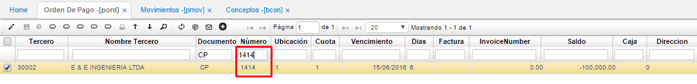

Cuando el registro de la cuenta por pagar ya es visualizado en la aplicación **PORD –  Orden de Pago**, podemos realizar algunos procesos parametrizados con anterioridad que nos permitirán realizar de manera correcta la confirmación de la orden de pago.  

### Cambio de Fecha

Botón que permite la actualización de la fecha en la que se realizará el pago. Para realizar el cambio de la fecha, se debe hacer clic sobre el botón _Actualiza Fecha_.  

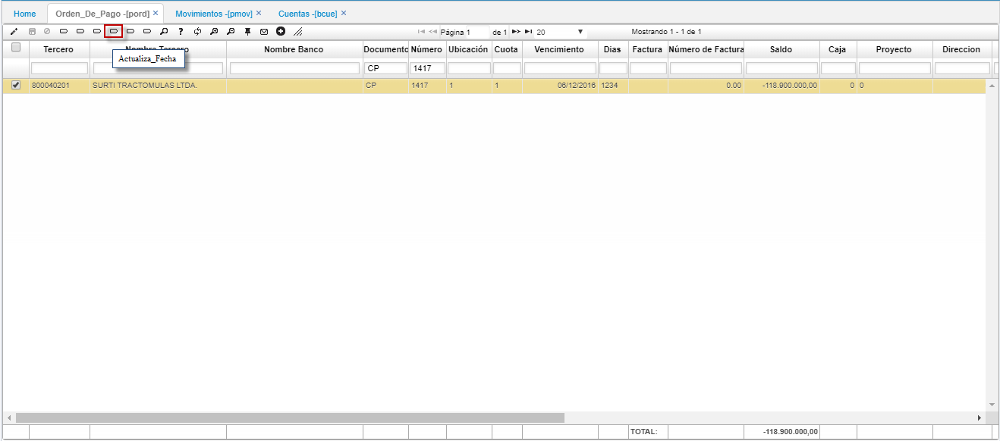

Automáticamente se abrirá un formulario en el que se debe activar el check _Modificar_, el cual habilitará el campo _Fecha de Pago_ y permitará realizar la modificación de esta.  

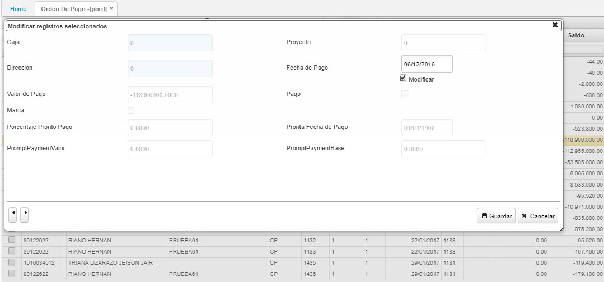

Se realiza la modificación de la fecha y se da click en _Guardar_.  

En el maestro se puede evidenciar el cambio de fecha en el campo **Fecha de Pago**.

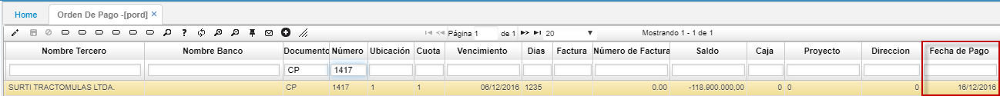

### Cambio de Banco

Botón que permite la actualización del Banco de donde se realizará el pago. Para realizar el cambio de Banco se debe hacer click sobre el botón Actualizar_Banco.  

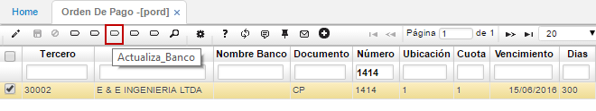

Automáticamente se abrirá un formulario en el que se debe activar el check _Modificar_, el cual habilitará el campo _Caja_ y permitirá realizar la modificación de esta.  

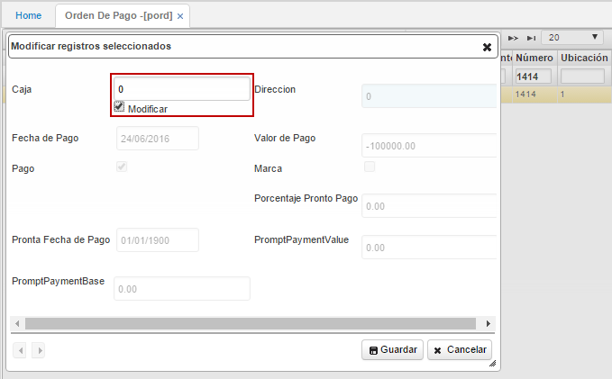

Se realiza la modificación al número de caja y se da click en _Guardar_.  

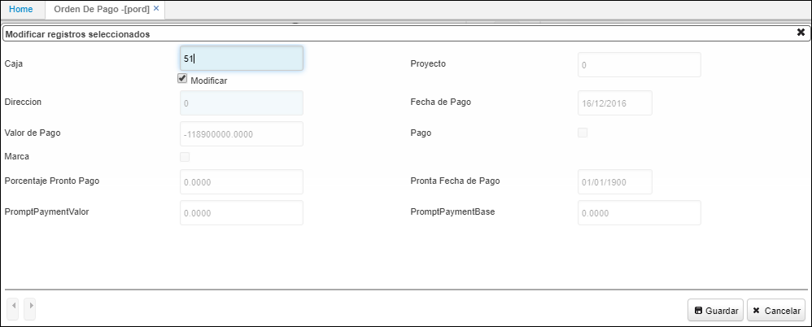

En el maestro se puede evidenciar el cambio de banco en el campo **Caja**.  

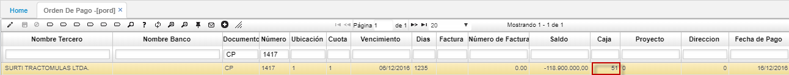

**Nota:** Es importante verificar que en la aplicación [**BUBI - Ubicaciones Organización**](https://github.com/OasisCom/Docs/blob/master/Operacion/common/borgan/bubi.md) en el registro del banco, el check del campo _Cash_ se encuentre activo.  

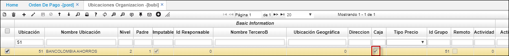

### Marcar Todo

Botón que permite la marcación de la Orden de pago, indicando que las cuentas que están marcadas son las que se van a pagar. Para realizar la marcación de la cuenta, se debe hacer click sobre el botón _Marcar_Todo_.  

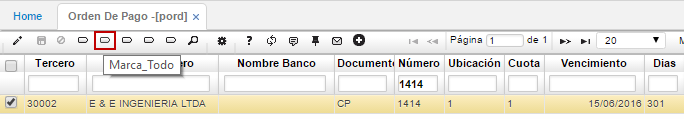

Automáticamente, se abrirá un formulario en el que se debe activar el check _Modificar_ para que se habilite el check del campo _Marca_ y permita ser activado, damos click en _Guardar_.  

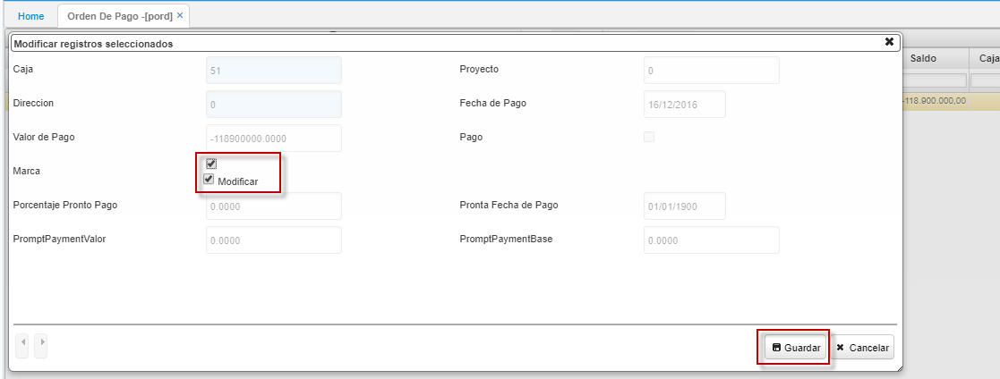

Al guardar el cambio, en el maestro se evidencia que la cuenta seleccionada tiene activo el check en el campo _Marca_.  

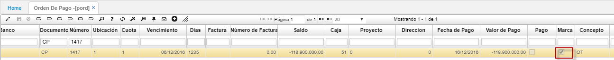

### Ordenar

Botón que permite la confirmación de la orden, al hacer click sobre este botón el sistema creará automáticamente un registro en la aplicación [**TMOV - Movimientos de Tesorería**](https://github.com/OasisCom/Docs/blob/master/Operacion/erp/tesoreria/tmovimient/tmov.md), el cual se compone de un maestro con un detalle específico.  

Al dar click el sistema arrojará un mensaje de control indicando que se realizó correctamente.  

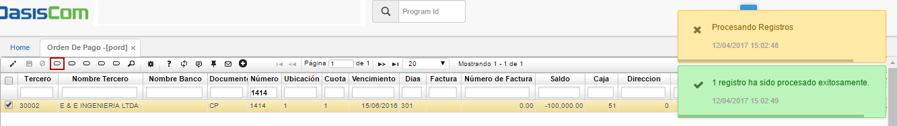

Sobre el registro ordenado, se puede evidenciar que el Check del campo _Pago_, paso de estar apagado a encendido, esto nos indica que la confirmación de la orden se generó de manera correcta.  

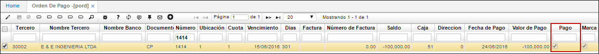

En  [**TMOV - Movimientos de Tesorería**](https://github.com/OasisCom/Docs/blob/master/Operacion/erp/tesoreria/tmovimient/tmov.md) deberá aparecer un registro como el siguente al realizar la consulta por fecha o tercero.  

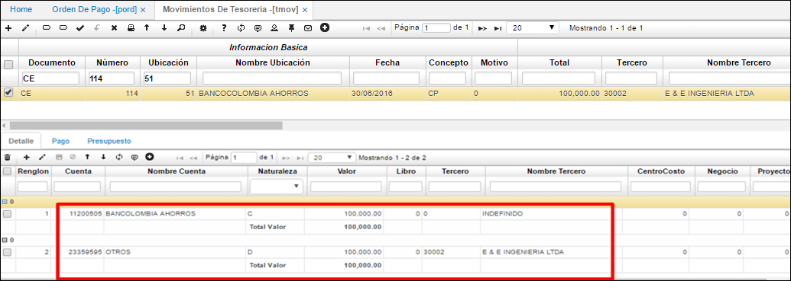

### Monto Autorizado

* El sistema posee la funcionalidad, a nivel de autorización de pagos desde PORD (órdenes de pago);  Para control de montos según el nivel que tenga autorizado en **SUSU** 

Los rangos se parametrizan en **BRAN** segun: documento concepto.  

*************

**Nota:** Los procesos anteriormente nombrados (cambio de fecha, cambio de banco, marcar todo y ordenar) se pueden realizar de manera masiva, es decir, se pueden seleccionar varios registros y dar click sobre el botón del proceso que deseamos realizar, este proceso se realizará para todos los registros seleccionados, se sugiere que si son muchos registros se realice el último paso (ordenar) por cada uno de los registros o de a tres registros para que el sistema procese más rápido los documentos. Por último, después de rectificar los datos, se debe procesar el registro en la aplicación [**TMOV - Movimientos de Tesorería**](https://github.com/OasisCom/Docs/blob/master/Operacion/erp/tesoreria/tmovimient/tmov.md), esto con el fin de que el cruce quede realizado de manera exitosa.  
