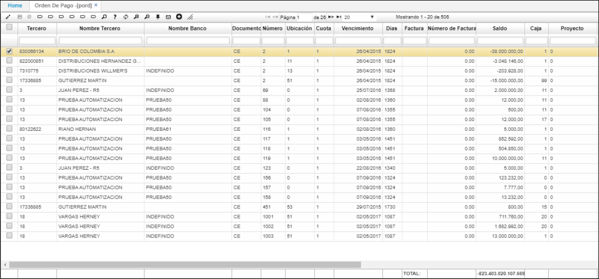

# Orden de Pago - PORD

Aplicación que permite consultar las cuentas que están pendientes por pagar e igualmente permite confirmar la orden de pago de cada una de ellas. Contiene los siguientes campos:

**Tercero:** Identificación del cliente, empleado o  tercero en general que presente saldo en cuentas por pagar.  
**Nombre Tercero:** Nombre del cliente, empleado o  tercero en general que presente saldo en cuentas por pagar.  
**Documento:** Hace referencia al tipo de comprobante.  
**Número:** Número con el cual se generó el comprobante.  
**Ubicación:** Identificación de la ubicación de un punto de la empresa.  
**Cuota:** Número de cuotas de la orden de pago.  
**Vencimiento:** Fecha de vencimiento de la orden de pago.  
**Días:** Días de vencimiento de la orden de pago.  
**Factura:** Factura a pagar.  
**Invoice Number:** Valor de la factura a pagar.  
**Saldo:** Saldo pendiente por pago.  

**Payment Date:** Fecha de pago de la Orden de Pago.  
**Payment Value:** Valor de pago de la Orden de Pago.  
**Pago:** Se marca si se realizó el pago.  
**Concepto:** Código del Concepto por el cual se hace el movimiento. Este define automáticamente la afectación contable del movimiento, por tanto debe estar perfectamente definido.  
**Moneda:** Campo que indica el tipo de moneda a manejar en la generación de los movimientos.  
**Cuenta:** Identificación numérica de las cuentas afectadas.  
**Prompt Payment Percentage:** Porcentaje que se pagará de la obligación.  
**Prompt Payment Date:** Fecha para el pronto pago de la obligación.  
**Prompt Payment Value:** Valor que se pagará de la obligación.  
**Plan:** En este campo se colocara el código del plan del cual se tomaran las cuentas.  

