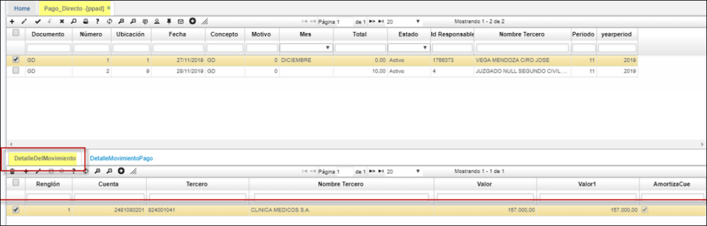

---

layout: default  

title:  Pago Directo  

permalink: /Operacion/erp/cuentas/porden/ppad  

editable: si  

---  

# Pago Directo - PPAD  

Para las EPS se crea la opción Pago Directo - PPAD; programa el Pago que realiza el Ministerio a los prestadores de salud. 

  

* Cuando se procesa el documento GD en el PPAD, el sistema ejecuta el botón de presupuesto.
Desde el PPAD agregando el porcentaje se modifica el procedimiento para que se haga el calculo proporcional al porcentaje.  

