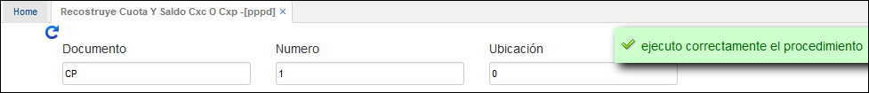

# Reconstruye Cuota y Saldo CXC o CXP - PPPD

La aplicación **PPPD** permite actualizar los saldos de las cuentas por cobrar o cuentas por pagar que se hayan generado previamente en las aplicaciones correspondientes. En caso de que los cambios realizados en dichas aplicaciones no se reflejen en las mismas, es necesario ejecutar el proceso **PPPD** y el sistema actualizará la información.  

**Documento:** Tipo de documento del cual se desea consultar (Cuenta por pagar – Cuenta por cobrar).  
**Número:** Número de documento del cual se desea realizar la consulta.  
**Ubicación:** Número de la ubicación (empresa) donde se encuentra el documento.  
