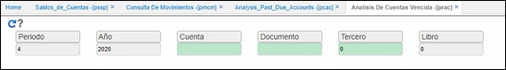
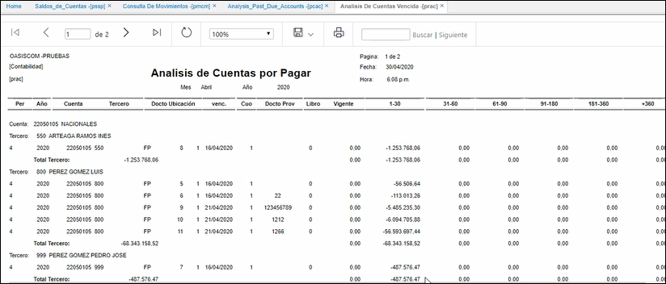

---

layout: default
title: Análisis de Cuentas Vencidas
permalink: /Operacion/erp/cuentas/preporte/prac
editable: si

---

# Análisis de Cuentas Vencidas - PRAC

La aplicación **PRAC** permite consultar el reporte de las cuentas por pagar vencidas discriminadas por días de vencimiento, se filtra por periodo, año, cuenta contable, documento, tercero y libro.  

* **Periodo:** ingresar el mes de consulta.  
* **Año:** ingresar el año de consulta.  
* **Cuenta:** ingresar el número de cuenta contable que se requiere consultar. Si no se conoce, dar doble clic en el campo y seleccionar del zoom la cuenta contable. Se deja el campo en blanco en caso que se desee consultar todas las cuentas.  

> 

* **Documento:** indicar el documento que se desea consultar. Si se desean consultar todos los documentos dejar este campo en blanco. Este campo también cuenta con un zoom en el cual se pueden observar todos los documentos y seleccionar el correspondiente.  

> 

* **Tercero:** ingresar el número de identificación del tercero del cual se desea realizar la consulta. Si se requiere consultar todos los terceros, dejar este campo en blanco.
* **Libro:** ingresar el número de libro contable del cual se desea consultar. Libro 1 - IFRS, libro 0 - LOCAL. Si se desea consultar ambos libros dejar el campo en blanco.  

Al realizar la consulta dando clic en el botón _generar_ , el sistema arrojará un reporte como el siguiente:

