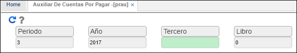
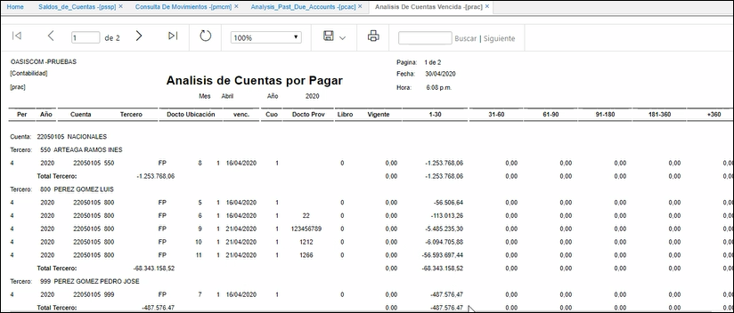

## Auxiliar de Cuentas por Pagar - PRAU

La aplicación **PRAU** permite consultar el reporte del libro auxiliar de Cuentas por Pagar, se filtra por periodo, año, tercero y libro.  

**Periodo:** ingresar el mes de consulta.  
**Año:** ingresar el año de consulta.  
**Tercero:** ingresar el núumero de identificación del tercero del cual se desea realizar la consulta. Si se requiere consultar todos los terceros, dejar este campo en blanco.  
**Libro:** ingresar el número de libro contable del cual se desea consultar. Libro 1 - IFRS, libro 0 - LOCAL. Si se desea consultar ambos libros dejar el campo en blanco.  

Al realizar la consulta dando click en el botón _generar_ , el sistema arrojará un reporte como el siguiente:  

