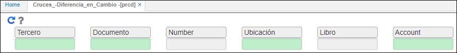
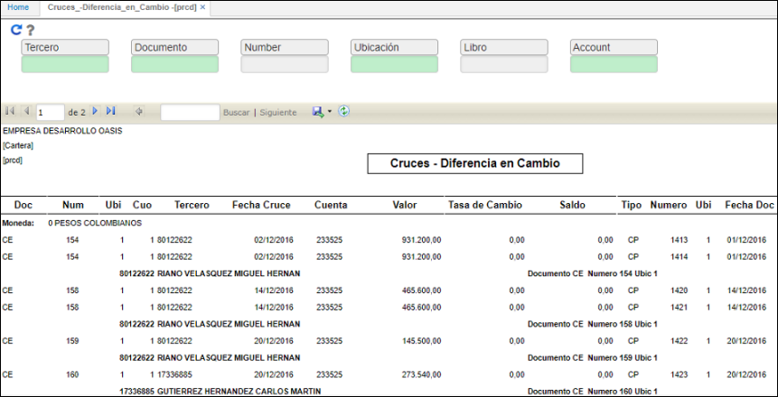

# PRCD - Cruces - Diferencia en Cambio

La aplicación PRCD muestra los cruces que se han realizado a diferentes documentos, en donde se puede indentificar el estado del documento original (cuenta por pagar o cuenta por cobrar) para el proceso de diferencia en cambio, es decir, los saldos, cuantos avances se han realizado, entre otros.  

PRCD cuenta con filtros de búsqueda, en donde se puede consultar por un tercero en específico, un documento, número del documento, ubicación, libro y cuenta. Para consultar damos click en el botón  

Si el usuario desea consulta todos los cruces realizados, bastará con solo dar click en el botón 

