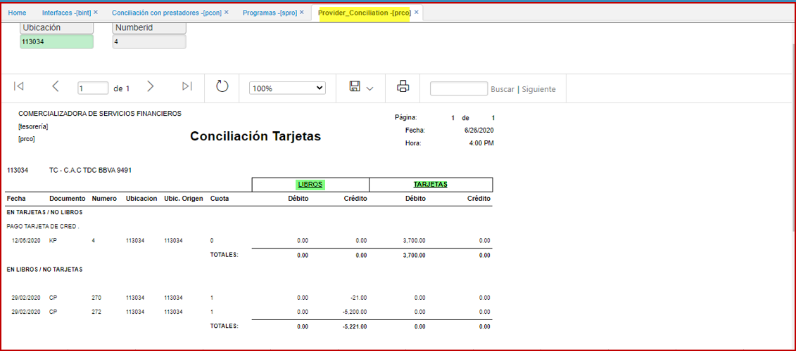
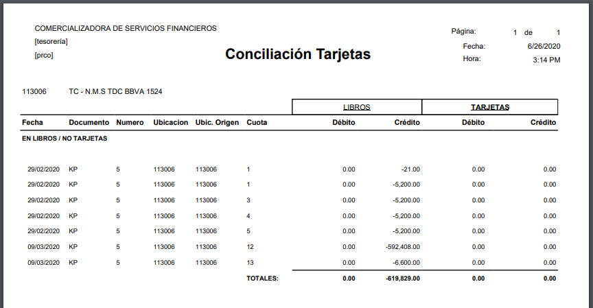

---

layout: default
title: Conciliación Tarjetas 
permalink: /Operacion/erp/cuentas/preporte/prco
editable: si

---

# Conciliación Tarjetas  - PRCO

Reporte que visualiza la informacion para realizar conciliación de tarjetas **[PRCO]**, módulo de cuentas por pagar; se extrae data del **TCON** como referencia.  
Realiza el agrupamiento por libros y tarjetas.  
Los parametros iniciales o de entrada se dan por la **ubicacion** del banco y el **numero** de la tarjeta.  

  

Al exportadr a PDF, con data se visualiza asi:

  

