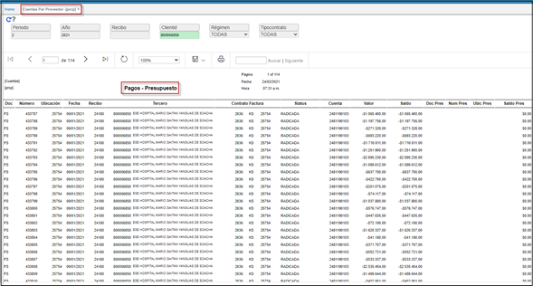

---

layout: default
title: C. Medicas Presupuesto - Pagos.
permalink: /Operacion/erp/cuentas/preporte/prcp
editable: si

---

# C. Medicas Presupuesto - Pagos. - PRCP

Reporte de modulo cuentas por pagar **PRCP**, donde se relacionan las llaves primarias de las facturas: documento, numero, ubicación, tercero, contrato factura.  Fecha, Status de la factura y el valor con su respectiva cuenta contable.  

Parámetros de entrada:  
**Periodo, Año, Recibo, Cliente, Régimen, Tipo_contrato.** 

  

