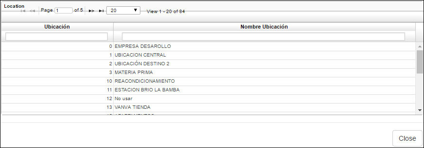
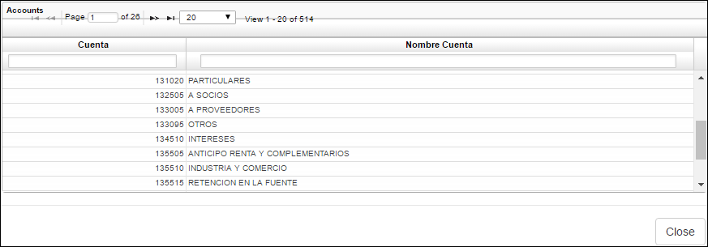

---
layout: default
title: Cruces
permalink: /Operacion/erp/cuentas/preporte/prcr
editable: si
---

## Cruces - PRCR

La aplicación **PRCR** permite consultar los cruces que se hayan realizado entre los  documentos.  

Para consultar, si se desean observar todos los cruces realizados, bastará con dar _Enter_ y el sistema arrojará un reporte con todos los cruces a la fecha. Si por el contrario, se requiere consultar un cruce en específico, el sistema permite filtrar por tercero, documento, número de documento, ubicación, libro y cuenta contable. Se diligencian los campos de acuerdo a la necesidad de consulta.  




**Tercero:** ingresar el número de identificación del tercero del cual se desea consultar el cruce, si se desconoce, dar doble click en el campo y seleccionarlo del zoom o dejar en blanco si no se requiere consultar un tercero en específico.  



**Documento:** ingresar el documento del cual se desea consultar el cruce. Si se desean consultar todos los documentos dejar en blanco. Este campo también cuenta con un zoom en el cual se pueden observar todos los documentos y seleccionar el correspondiente.  



**Número:** si se requiere consultar un cruce en específico, ingresar el número del documento.  
**Ubicación:** número de ubicación de la cual se realizará la consulta. Si se desconoce seleccionarla del zoom.  



**Libro:** ingresar el número de libro contable del cual se desea consultar. Libro 1 - IFRS, libro 0 - LOCAL. Si se desea consultar ambos libros dejar el campo en blanco.  
**Cuenta:** ingresar el número de cuenta contable que se requiere consultar. Si no se conoce, dar doble click en el campo y seleccionar del zoom la cuenta contable. Se deja el campo en blanco en caso que se deseen consultar todas las cuentas.  




Al realizar la consulta dando click en el botón _generar_ , el sistema arrojará un reporte como el siguiente:






