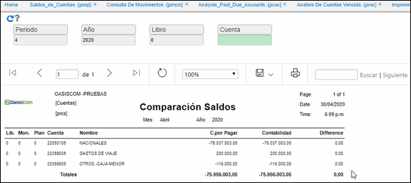

---
layout: default
title: Comparación Saldos
permalink: /Operacion/erp/cuentas/preporte/prcs
editable: si
---

## Comparación Saldos - PRCS

La aplicación **PRCS** nos permite comparar los saldos que se encuentran registrados en el módulo de Cuentas por Pagar con los saldos de Contabilidad y así poder identificar si existe diferencia. 

La aplicación cuenta con algunos filtros que permite hacer más específica la consulta. Si se desean consultar todos los saldos no se ingresa ningún dato y sencillamente se da _Enter_.  




**Periodo:** ingresar el número del mes del cual se desea realizar la comparación de saldos.  
**Año:** indicar el año del cual se desea realizar la comparación de saldos.
**Libro:** ingresar el número de libro contable del cual se desea consultar. Libro 1 - IFRS, libro 0 - LOCAL. Si se desea consultar ambos libros dejar el campo en blanco.  
**Cuenta:** ingresar el número de cuenta contable que se requiere consultar. Se deja el campo en blanco en caso que se desee consultar todas las cuentas.  

Al realizar la consulta dando click en el botón _generar_ , el sistema arrojará un reporte como el siguiente:




