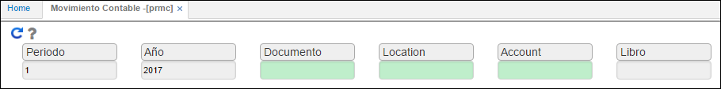

---
layout: default
title: Movimiento Contable
permalink: /Operacion/erp/cuentas/preporte/prmc
editable: si
---

# Movimiento Contable - PRMC


La aplicación **PRMC** permite consultar los movimientos contables que se hayan realizado en el módulo de _Cuentas por Pagar_ de acuerdo a los datos de consulta, igualmente, poder comparar los valores débito y crédito.




**Periodo:** ingresar el número correspondiente al mes de consulta.  
**Año:** ingresar el año de consulta.  
**Documento:** ingresar el documento de consulta, si se desconoce dar doble clic y seleccionar del zoom el documento. Si por el contrario se desean consultar todos los documentos, este campo se dejará en blanco.  



**Ubicación:** ingresar la ubicación desde la cual se desea realizar la consulta, si se desconoce dicha ubicación dar doble clic en el zoom y seleccionarla de allí. Dejar el campo en blanco en caso tal que no se requiera consultar una ubicación en específico.  



**Cuenta:** ingresar la cuenta contable de la cual se desea realizar la consulta. Dejar el campo en blanco si no se requiere consultar una cuenta en específico. Igualmente, cuenta con un zoom en el cual se puede seleccionar la cuenta correspondiente.  



**Libro:** indicar el libro contable del cual se realizará la consulta. Libro 1 - IFRS, libro 0 - LOCAL.


