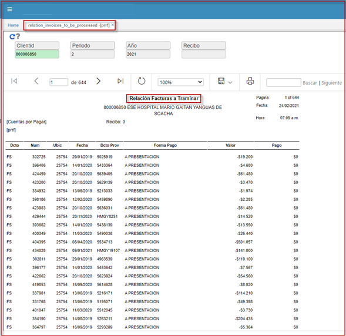

---

layout: default
title: Relacion Facturas a Tramitar
permalink: /Operacion/erp/cuentas/preporte/prrf
editable: si

---

# Relacion Facturas a Tramitar - PRRF

Reporte de modulo cuentas por pagar **PRRF**; donde se relacionan las llaves primarias de las facturas: documento, numero, ubicación indicando la forma de pago, fecha y documento del proveedor con su respectivo monto o valor.  

Parámetros de entrada:  
**Cliente, periodo, año, recibo.**  

