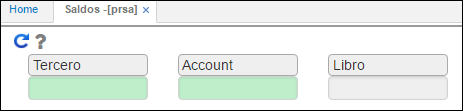

---
layout: default
title: Saldos
permalink: /Operacion/erp/cuentas/preporte/prsa
editable: si
---

# Saldos - PRSA

La aplicación **PRSA** permite consultar el saldo de las cuentas por pagar de acuerdo a los datos ingresados en los filtros.  





**Tercero:** si se desea consultar las cuentas por pagar de un tercero en específico, digitar el número de identificación del tercero o dar doble click y seleccionarlo del zoom si se desconoce. Si se requiere consultar los saldos de todos los terceros no se ingresa ningún dato y se deja el campo en blanco.  
**Cuenta:** ingresar el número de cuenta contable que se requiere consultar. Se deja el campo en blanco en caso que se desee consultar todas las cuentas.  
**Libro:** ingresar el número de libro contable del cual se desea consultar. Libro 1 - IFRS, libro 0 - LOCAL. Si se desea consultar ambos libros dejar el campo en blanco.  


Al realizar la consulta dando click en el botón _generar_ , el sistema arrojará un reporte como el siguiente:


