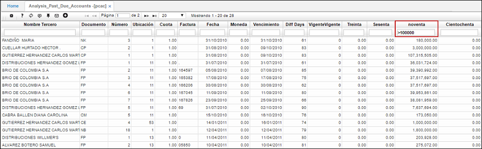

---
layout: default
title: Análisis de Cuentas Vencidas
permalink: /Operacion/erp/cuentas/psaldo/pcac
editable: si
---

# Análisis de Cuentas Vencidas - PCAC

La aplicación **PCAC** permite consultar mediante filtros las cuentas por pagar a proveedores, ya sea por días o rangos de las cuentas. Por ejemplo, a continuación consultaremos las cuentas por pagar vencidas a noventa dias a todos los proveedores y mayores a $100.000.  




