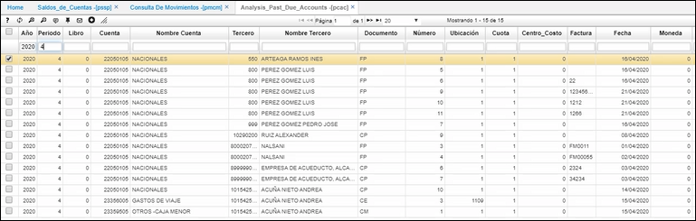

---

layout: default
title: Análisis de Cuentas Vencidas
permalink: /Operacion/erp/cuentas/psaldo/pcac
editable: si

---

# Análisis de Cuentas Vencidas - PCAC

La aplicación **PCAC** permite consultar para un año y un periodo determinado mediante filtros las cuentas por pagar a proveedores, ya sea por días o rangos de vencimientos de cada una de las cuentas cuentas por pagar. 
 
Establece los dias de vencimiento de la cuenta por pagar y sus diferentes edades de *1 a 30, 31 a 60, 61 a 90, 91 a 180, 181 a 360,* superiores a *360* dias, como se ilustra el ejemplo. 

