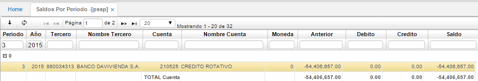
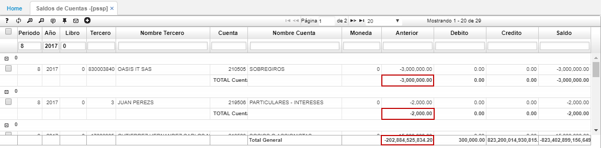
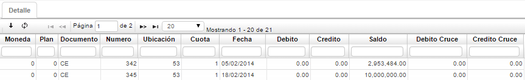

# Saldos por Periodo - PSSP

Como el sistema es en línea, o sea es afectado por cada uno de los movimientos efectuados por cualquier proceso, se tienen los saldos periódicos con el fin de facilitar la emisión de estados de cuentas, extractos o balances y para la consolidación de la información con el módulo de Contabilidad.  

La aplicación contiene los siguientes campos en el maestro:  

**Año:** Año (s) del estado histórico de cuentas por pagar de un tercero.  
**Periodo:** Mes (es) del estado histórico de cuentas por pagar del tercero.  
**Tercero:** Identificación del cliente, empleado o  tercero en general con saldos o movimientos en Cuentas por Pagar.  
**Nombre Tercero:** Nombre del cliente, empleado o tercero en general con saldos o movimientos en Cuentas por Pagar.  
**Cuenta:** Cuenta contable donde reside la operación.  
**Nombre Cuenta:** Nombre de la cuenta contable donde reside la operación.  
**Moneda:** Tipo de moneda en la cual se realizan las operaciones.  
**Anterior:** Saldo al iniciar el periodo.  
**Débito:** Movimientos débitos efectuados durante el periodo.  
**Crédito:** Movimientos créditos efectuados durante el periodo.  
**Saldo:** Saldo final del periodo.  

La aplicación permite ver la sumatoria total del saldo por cada cuenta administrada y el total general de todas las cuentas.  

Esta aplicación cuenta con un detalle el cual explicamos a continuación:  

**Moneda:** Tipo de moneda en la cual se realizan las operaciones.  
**Plan:** En este campo se colocara el código del plan del cual se tomaran las cuentas.  
**Documento:** Tipo de documento contable del cual se compone el saldo del tercero consultado.  
**Número:** Número del documento registrado en el saldo del tercero consultado.  
**Ubicación:** Ubicación organizacional que genero el documento.  
**Cuota:** Número de la cuota, en caso de pactarse pagos por cuotas.  
**Fecha:** Fecha del documento.  
**Débito:** Movimientos débitos del documento.  
**Crédito:** Movimientos crédito del documento.  
**Saldo:** Saldo del documento.  
**Débito cruce:** Valores dedito aplicados de dicho documento en el periodo consultado.  
**Crédito cruce:** Valores crédito aplicados de dicho documento en el periodo consultado.  

**Nota:** La diferencia entre los Saldos de Cuentas por Pagar y Saldos Periódicos radica en que los últimos son el resultado histórico en los respectivos periodos, conteniendo saldo Inicial del periodo, movimientos tanto Débito como Crédito y el saldo al final de cada periodo histórico, por su parte los saldos de cuentas por pagar, es el saldo actualizado, que contiene los movimientos más inmediatos al momento de la consulta, lo que se conoce como  “Saldo en Línea”.  

