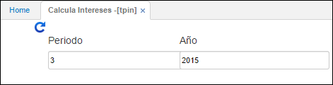

# Calcula Intereses - TPIN

Proceso que se debe generar para liquidar los intereses de inversiones del periodo en consulta. Este proceso genera automáticamente un documento **NK** con concepto **II** en la aplicación **KMOV - Movimientos de Tesorería**, en la cual verificamos los intereses de las invesiones en el detalle del documento.  

Recurde que las caracteristicas de las inversiones deben estar previamente parametrizadas en la aplicación **TINV - Inversiones**.

Se consulta por periodo y año.  

