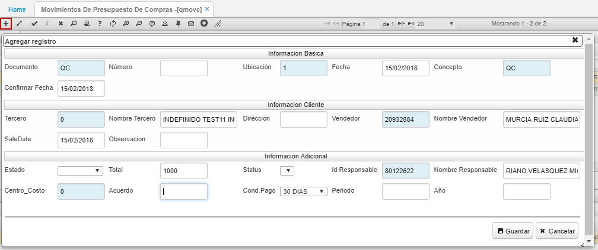
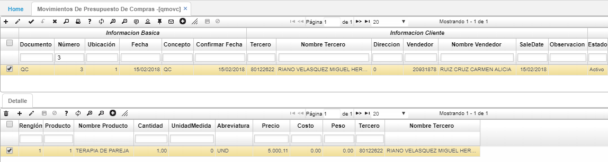

# Presupuesto De Compras - QMOVC

El documento en la opción **QMOVC** realiza la afectación del presupuesto de compras y la comparación sobre las compras reales de los diferentes productos comercializados por la empresa.  

Para ingresar un nuevo documento damos click en el botón **+**.  

Diligenciamos los campos y guardamos. En el detalle de la aplicación ingresaremos el producto de compra.  

Finalmente, procesamos el documento dando click en el botón  para que se realice la afectación al presupuesto de compras.  