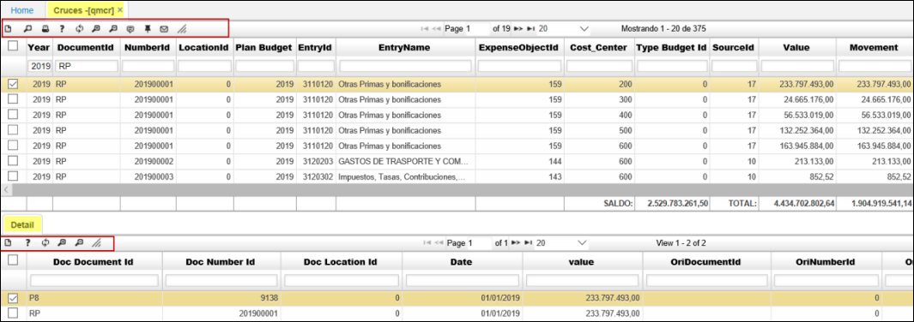

## Cruces Presupuesto - QMCR

**Entrada:** La entrada de datos a esta aplicación provienen de la aplicación **QMOVO** para las instancias 1,2,3 (movimientos PRESUPUESTALES). Cuando el escenario sea con las instancias 4 y/o 5 puede ser movimientos desde: QMOVO, PMOV, CMOV, TMOV, TMEN:
* Instancia 1: PI (PRESUPUESTO INICIAL), TP (TRASLADO PRESUPUESTAL), MD (MODIFICACION)etc.  
* Instancia 2: CD (CERTIFICADO DISPONIBILIDAD PRESUPUESTAL), RD (DECREMENTO DE DISPONIBILIDAD), 		UD (INCREMENTO DE DISPONIBILIDAD) etc.  
* Instancia 3. RP (REGISTRO PRESUPUESTAL, RR (DECREMENTO DE REGISTRO PRESUPUESTAL), AR (INCREMENTO DE REGISTRO PRESUPUESTAL)etc.  
* Instancia 4: CP, NB, FP etc.  
* Instancia 5: CE, DB etc.  
**nota:** 4, 5 puede ser QMOVO, PMOV, CMOV, TMOV, TMEN etc.  
 ejemplo: comprobantes de egreso, cuentas por pagar, notas crédito, recibos de caja entre otros.  

**Proceso:** Opción para visualizar cruces presupuestales. No existe botones de cruces.

**Salida:** Los datos de salida de este proceso se observan en las consultas de los saldos de las cuentas de los terceros, en los reportes  del modulo de los terceros; o en los reportes de cruces que presentan los diferentes modulos.  

**Year:** Año en el que se va a realizar el cruce.  

**Documento:** Son los documentos que se han creado para ser utilizados en el módulo de cuentas por pagar, tan Notas Débito, Notas Crédito, Comprobantes de Egreso y Cuentas por Pagar.  
**Número:** Numero con el cual se generó el documento.  
**Ubicación:** Identificación de la ubicación de un punto de la empresa.  
**Plan Budget:** Plan presupuestal.  
**EntrId:** Entrada. nombre de entrada.  
**Expense Objet:** Objeto de gasto.  
**Cost Center:** Centro de Costo.
**Type Budget:** Tipo Presupuesto.  
**Source:** Fuente.  
**Fecha:** Fecha en la que se realiza el cruce.  
**Vencimiento:** Fecha en la que se realiza el cruce.  
**Valor:** Monto total de la deuda.  
 

Esta aplicación cuenta con un detalle en donde se pueden identificar los documentos que se han cruzado con el documento original que se encuentra en el maestro, solo es visual no es editable.

