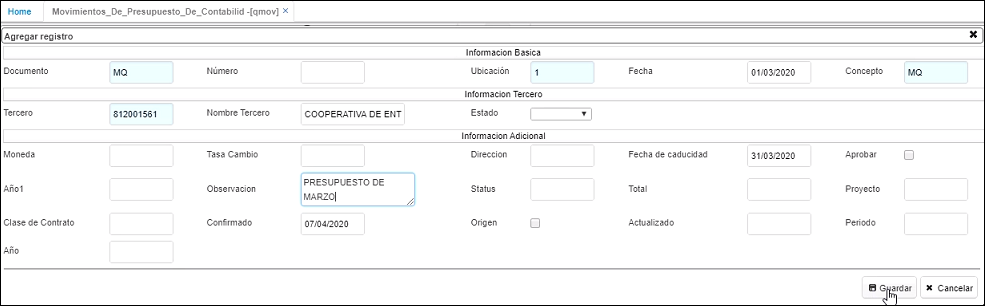

# QMOV - Movimiento de Presupuesto de Contabilidad

La aplicación **QMOV** nos permite registrar el presupuesto de contabilidad, en donde en el detalle ingresaremos las cuentas contables del gasto y los valores que se presupuestarán para las mismas.  

Ingresamos a la aplicación y creamos un nuevo registro en el maestro.  

