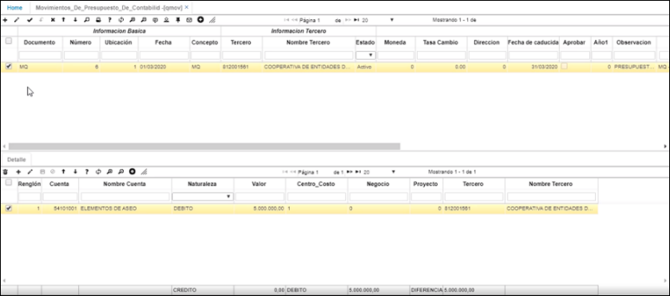
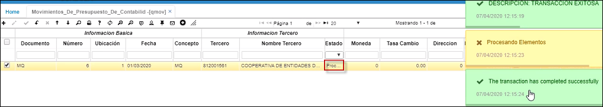

# QMOV - Movimiento de Presupuesto de Contabilidad

La aplicación **QMOV** nos permite registrar el presupuesto de contabilidad, en donde en el detalle ingresaremos las cuentas contables del gasto y los valores que se presupuestarán para las mismas.  

Ingresamos a la aplicación y creamos un nuevo registro en el maestro (+). Se creará un **_Documento_** **MQ** de Movimiento de Presupuesto de contabilidad con la ubicación parametrizada previamente en la opción [BUBI - Ubicaciones organizacón](http://docs.oasiscom.com/Operacion/common/borgan/bubi). Seleccionamos del zoom el concepto por el cual se hace el presupuesto.    

**Ubicación:** la que corresponda.  
**Fecha:** se debe tener en cuenta que se puede generar un documento por mes o un documento por año.
**Concepto:** siempre se vaa generar **_Concepto_** **MQ** de movimiento de presupuesto de contabilidad.
**Tercero:** ingresar el número de identificación del usuario que registra el presupuesto.  
**Moneda:** el sistema permite registrar presupuestos en varios tipos de moneda como el peso, dolar, entre otras. En este campo ingresamos el número que identifica cada moneda: 0 para pesos colombianos, 1 para dólar. Las monedas se parametrizan en la opción [BMON - Monedas](http://docs.oasiscom.com/Operacion/common/bfinan/bmon).  
**Tasa Cambio:** en caso que el presupuesto se realice en otro tipo de moneda diferente al peso colombiano, ingresar la tasa de cambio del día que se registra.  
**Fecha de Caducidad:** fecha hasta la cual aplicará el presupuesto.  
**Observación:** ingresar alguna observación correspondiente al presupuesto.  

Ingresados los datos, damos click en el botón _Guardar_.  

En el detalle, agregamos un nuevo renglón en donde relacionaremos las cuentas contables que se presupuestarán.  

**Cuenta:** seleccionar del zoom la cuenta contable a presupuestar.  
**Naturaleza:** seleccionar la naturaleza de la cuenta contable.  
**Valor:** ingresar el valor a presupuestar a dicha cuenta contable.  
**Centro Costo:** seleccionar del zoom el centro de costo al cual se cargará el presupuesto de la cuenta contable seleccionada.  Se puede registrar uno específico si se quiere generar un presupuesto por centro de costo detallado o uno genérico si no se quiere utilizar así.  
**Negocio:** en caso de que aplique, seleccionar el negocio al cual se relacionará el presupuesto de la cuenta.  
**Proyecto:** seleccionar el proyecto al cual se relacionará el presupuesto de la cuenta.  
**Tercero:** ingresar el número de identificación del usuario al cual se le relacionará el presupuesto.  

Presupuestadas todas las cuentas contables definidas se deberá procesar el presupuesto desde la barra de herramientas del maestro.  

En la aplicación [QRCE - Ejecución presupuestal - Centro de Costo](http://docs.oasiscom.com/Operacion/erp/presupuesto/qcreporte/qrce) se consulta la ejecución del presupuesto registrado en QMOV.  
