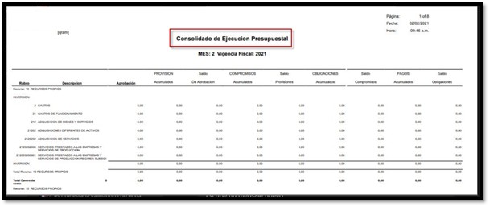

# Apropiación por centro de costo, consolidada - QRAM1C  

Reporte **QRAM1C**  Apropiación por centro de costo, consolidada. Módulo presupuesto.  Se realiza la creación del reporte QRAM1C agrupando los saldos de presupuesto, por centro de costo totalizando por los mismos.  

  

  