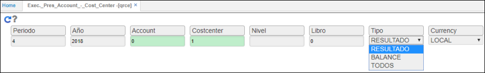
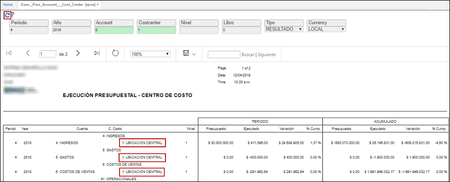
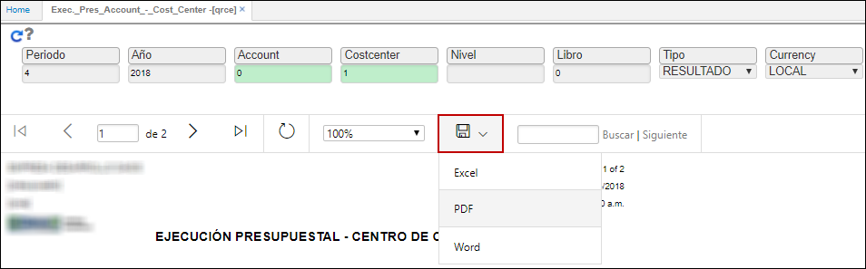

---
layout: default
title: Ejecución Presupuestal - Centro de Costo
permalink: /Operacion/erp/presupuesto/qcreporte/qrce
editable: si
---

# Ejecución Presupuestal - Centro de Costo - QRCE

La aplicación **QRCE** permite generar de acuerdo a los criterios de consulta, un reporte con la ejecución financiera especificado por centros de costos.  

Ingresamos a la aplicación y consultamos por los datos que deseemos.  



En el ejemplo anterior, consultamos el periodo 4 (abril), año 2018, centro de costo 1, libro contable **0** Local, Tipo _Resultado_ (esta lista desplegable permite seleccionar el tipo de información que deseamos consultar de una forma más óptima y precisa) y moneda local (peso). Ingresada la información damos click en el botón .  

El sistema arrojará un reporte con la ejecución presupuestal del centro de costo 1 como lo indicamos en la consulta.  



El reporte puede ser descargado en formato Word, PDF o Excel.  

