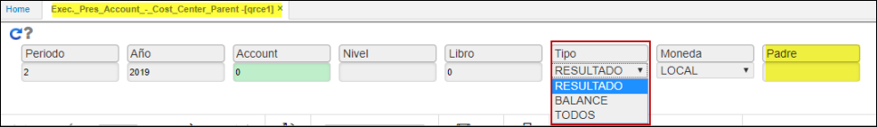

# Ejecución Presupuestal - Centro de Costo Padre - QRCE1  

La aplicación **QRCE1** permite generar de acuerdo a los criterios de consulta, un reporte con la ejecución financiera especificado por centros de costo padre.  

Ingresamos a la aplicación y consultamos por los datos que deseemos.  
Se ingresan parámetros de búsqueda.  
EL parametro PADRE es obligatorio, si no se ingresa el reporte no consulta información.  

La realizar el filtro en padre 1, extrae la información que contenga en el BUBI donde existan centros de costos solo con padre 1.  
Ingresada la información damos click en el botón .  

El reporte puede ser descargado en formato Word, PDF o Excel.  

