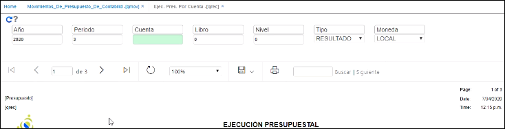

# Ejecución presupuestal por cuenta - QREC

Esta aplicación sirve para ver el presupuesto por cuenta contable.  

Una vez registrado el presupuesto de contabilidaden la aplicación [**QMOV - Movimiento**](http://docs.oasiscom.com/Operacion/erp/presupuesto/qcontabili/qmov) de Presupuesto de Contabilidad, se puede ingresar a esta aplicación para ver el presupuesto por cuenta contable.  

En la ilustración, se consulta el periodo 3  

  

a nivel de la cuenta del gasto se evidencian los $5.000.000,oo presupuestados, $1.770.266,66 ejecutados para un rendimiento del 35.00%.  

  

Igualmente se puede entrar a consultar por la cuenta contable en específico si se requiere.    

