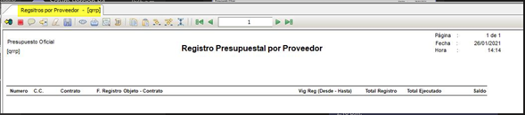

---

layout: default

title: Registro Presupuestal por Proveedor

permalink: /Operacion/erp/presupuesto/qcreporte/qrrp

editable: si

---

# Registro Presupuestal por Proveedor - QRRP

Reporte **QRRP**. Genera información de registro presupuestal por proveedor por periodo o anual. Esta información se toma de documentos RP y R8 a nivel del modulo **QMOVO** y el historial se encuentra en la aplicación **QDOC**. Este reporte realiza una suma global a nivel de proveedeor correspondiente al Documento **RP y R8**.   

