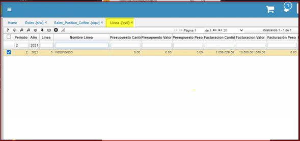

# Linea Presupuesto- QVLI  

Opción de presupuesto por línea donde se puedan evidenciar las compras ejecutadas vs. compras presupuestadas. Esta opción podrá estar disponible en la opción **QVLI**, como se ilustra:  

Ejecución  Presupuestal en Compras de  Café.  

  

