# Movimientos de Presupuesto Oficial - QMOVO

La aplicación QMOVO permite realizar movimientos en el presupuesto oficial. En el detalle, se puede indicar cual es el objeto del gasto en caso de serlo y el centro de costo al cual se carga.  
* El Campo 'RecordCommerce' relaciona el  número de solicitud.  

## [Vistas previas de los documentos](http://docs.oasiscom.com/Operacion/erp/presupuestoo/qmovimient/qmovo#vistas-previas-de-los-documentos)

Los documentos que se registran en la aplicación QMOVO cuentan con vistas previas que permiten ver la información de forma más clara.  

Documentos:

* [**PI - Presupuesto Inicial**](http://docs.oasiscom.com/Operacion/erp/presupuestoo/qmovimient/qmovo#pi---presupuesto-inicial)  
* [**CD - Certificado Disponibilidad Presupuestal**](http://docs.oasiscom.com/Operacion/erp/presupuestoo/qmovimient/qmovo#cd---certificado-disponibilidad-presupuestal)  
* [**RP - Registro Presupuestal**](http://docs.oasiscom.com/Operacion/erp/presupuestoo/qmovimient/qmovo#rp---registro-presupuestal)  
* [**UD - Incremento de una provisión**](http://docs.oasiscom.com/Operacion/erp/presupuestoo/qmovimient/qmovo#ud---incremento-de-una-provisión)
* [**TP - Traslado Presupuestal**](http://docs.oasiscom.com/Operacion/erp/presupuestoo/qmovimient/qmovo#tp---traslado-presupuestal)
* [**AR - Incremento de registro presupuestal**](http://docs.oasiscom.com/Operacion/erp/presupuestoo/qmovimient/qmovo#ar---incremento-de-registro-presupuestal)
* [**C3 - Cargue inicial ejecución**](http://docs.oasiscom.com/Operacion/erp/presupuestoo/qmovimient/qmovo#c3---cargue-inicial-ejecución)
* [**RD - Liberación o anulación de una provisión**](http://docs.oasiscom.com/Operacion/erp/presupuestoo/qmovimient/qmovo#rd---liberación-o-anulación-de-una-provisión)
* [**RR - Decremento de registro presupuestal**](http://docs.oasiscom.com/Operacion/erp/presupuestoo/qmovimient/qmovo#rr---decremento-de-registro-presupuestal)
* [Fuera de Red en Presupuesto Oficial](http://docs.oasiscom.com/Operacion/erp/presupuestoo/qmovimient/qmovo#fuera_de_red_en_presupuesto_oficial)

## [PI - Presupuesto Inicial](http://docs.oasiscom.com/Operacion/erp/presupuestoo/qmovimient/qmovo#pi---presupuesto-inicial)  

Esta vista previa permite visualizar el estado de las cuentas del presupuesto inicial.  

Damos click en el botón _Presentación preliminar_.  

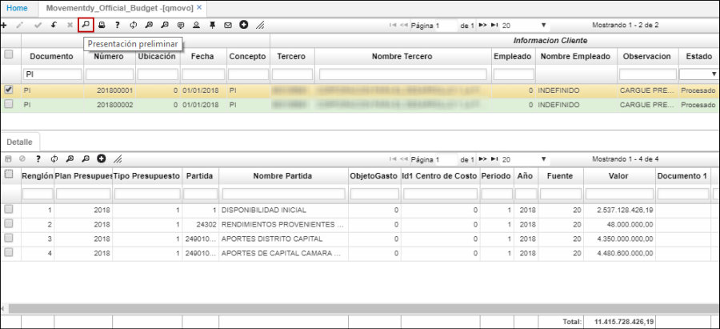

Al consultar veremos el documento de la siguiente manera:  

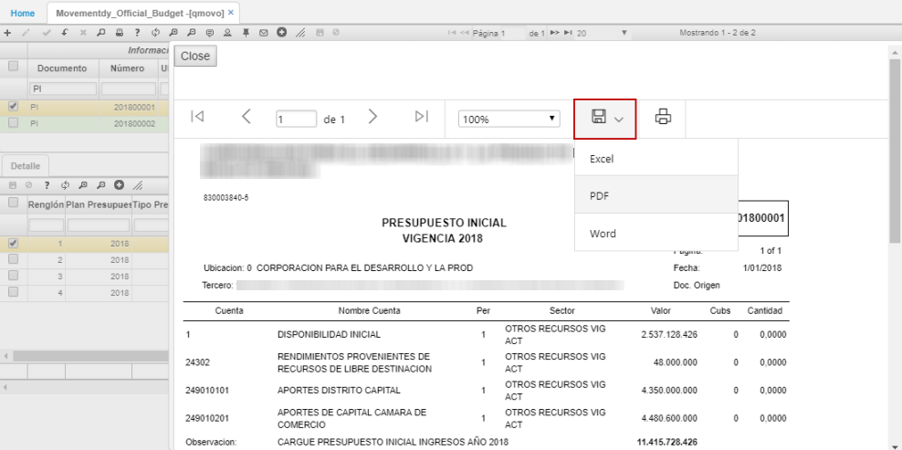

El documento puede ser extraíble en formato de Excel, PDF o Word.  

_En PDF_  

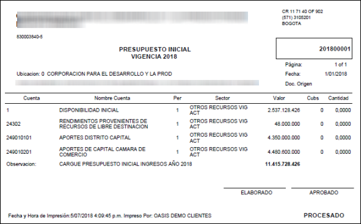

## [CD - Certificado Disponibilidad Presupuestal](http://docs.oasiscom.com/Operacion/erp/presupuestoo/qmovimient/qmovo#cd---certificado-disponibilidad-presupuestal)  

Esta vista previa permite visualizar el estado de los rubros presupuestales.  

Damos click en el botón _Presentación preliminar_.  

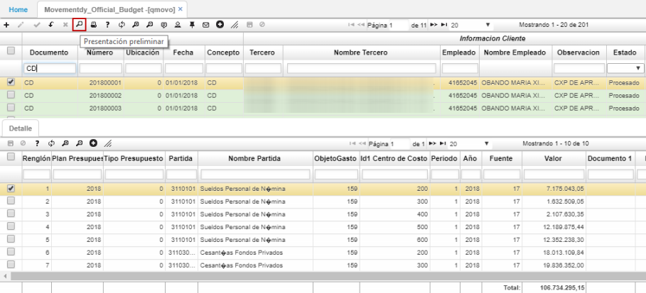

Al consultar veremos el documento de la siguiente manera:  

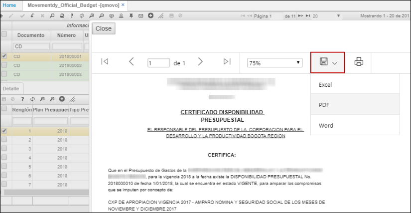

El documento puede ser extraíble en formato de Excel, PDF o Word.  

_En PDF_  

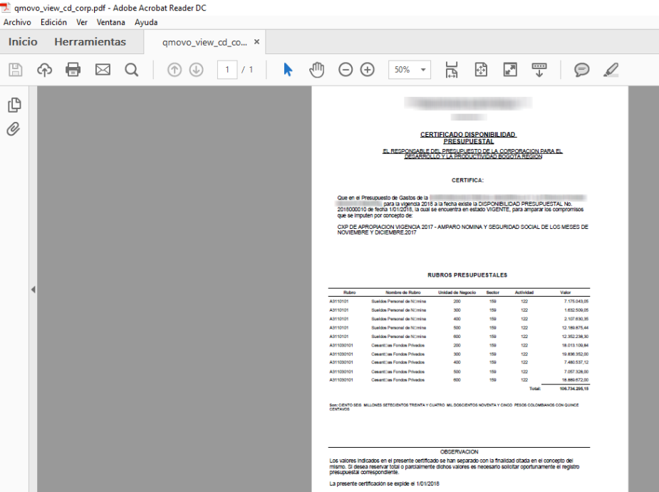

## [RP - Registro Presupuestal](http://docs.oasiscom.com/Operacion/erp/presupuestoo/qmovimient/qmovo#rp---registro-presupuestal)

Esta vista previa permite visualizar el estado de los rubros presupuestales de dicho documento.  

Damos click en el botón _Presentación preliminar_.  

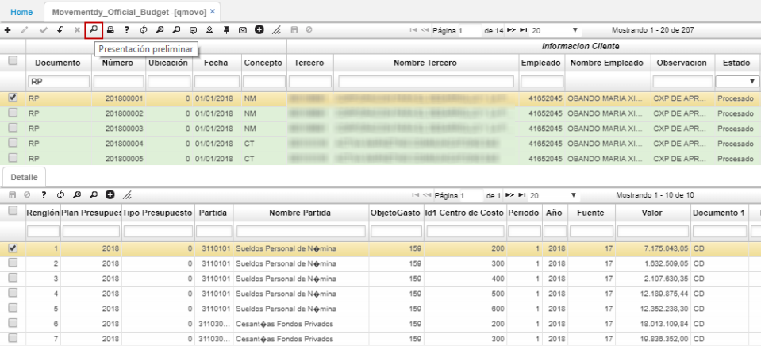

Al consultar veremos el documento de la siguiente manera:  

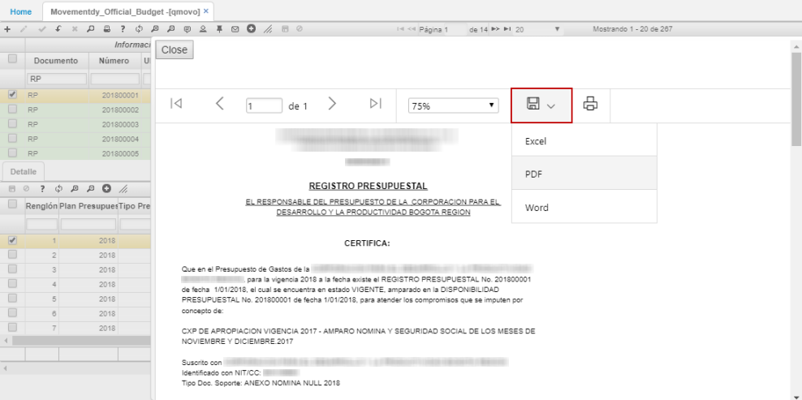

El documento puede ser extraíble en formato de Excel, PDF o Word.  

_En PDF_  

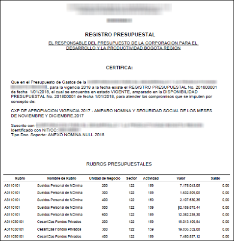

## [UD - Incremento de una provisión](http://docs.oasiscom.com/Operacion/erp/presupuestoo/qmovimient/qmovo#ud---incremento-de-una-provisión)

Esta vista previa permite visualizar el estado de las cuentas de los rubros presupuestales.  

Damos click en el botón _Presentación preliminar_.  

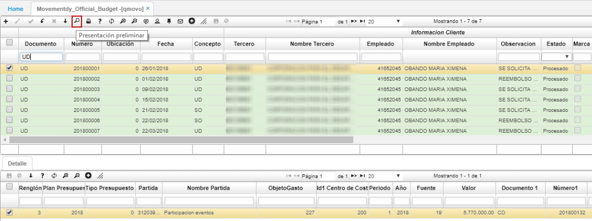

Al consultar veremos el documento de la siguiente manera:  

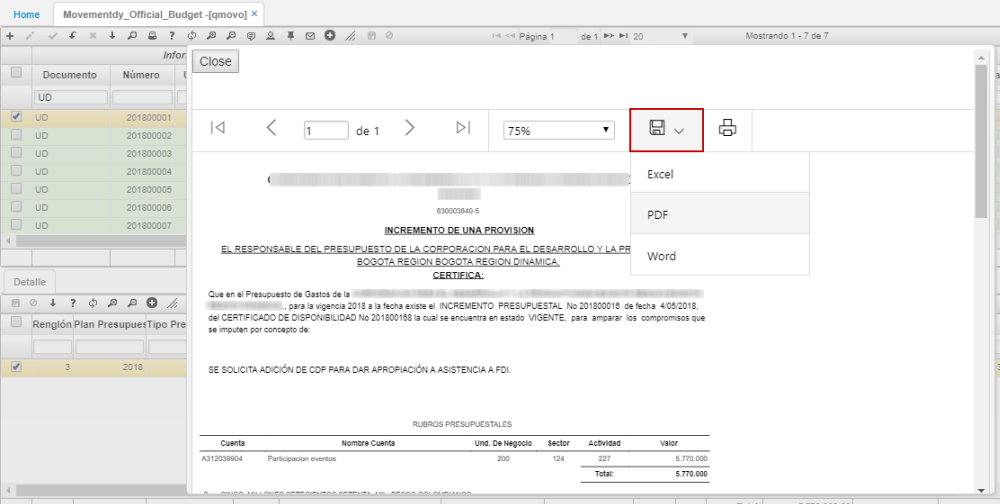

El documento puede ser extraíble en formato de Excel, PDF o Word.  

_En PDF_  

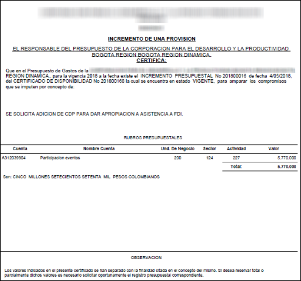

## [TP - Traslado Presupuestal](http://docs.oasiscom.com/Operacion/erp/presupuestoo/qmovimient/qmovo#tp---traslado-presupuestal)

Esta vista previa permite visualizar el estado de las cuentas para traslado presupuestal.  

Damos click en el botón _Presentación preliminar_.  

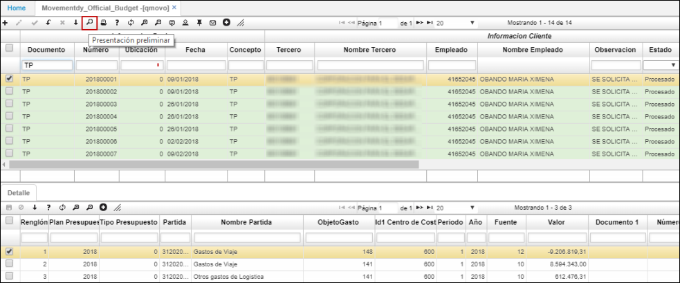

Al consultar veremos el documento de la siguiente manera:  

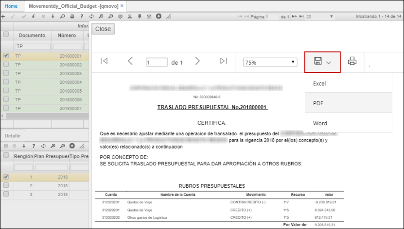

El documento puede ser extraíble en formato de Excel, PDF o Word.  

_En PDF_  

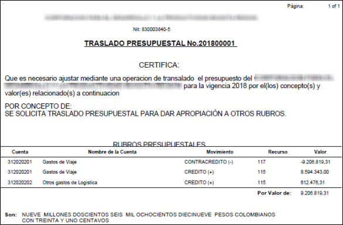

## [AR - Incremento de registro presupuestal](http://docs.oasiscom.com/Operacion/erp/presupuestoo/qmovimient/qmovo#ar---incremento-de-registro-presupuestal)

Esta vista previa permite visualizar el estado de las cuentas para incremento presupuestal.  

Damos click en el botón _Presentación preliminar_.  

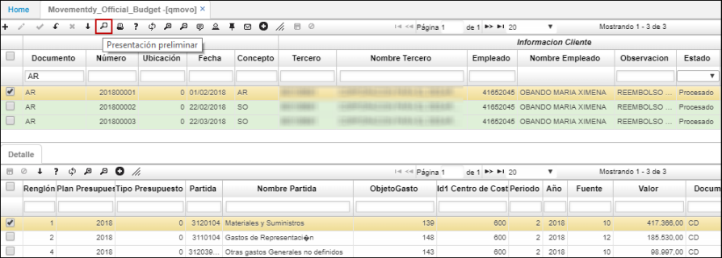

Al consultar veremos el documento de la siguiente manera:  

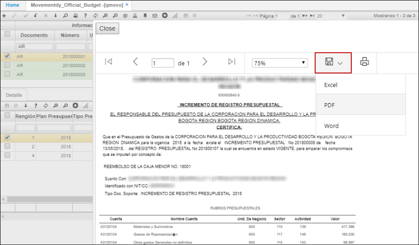

El documento puede ser extraíble en formato de Excel, PDF o Word.  

_En PDF_  

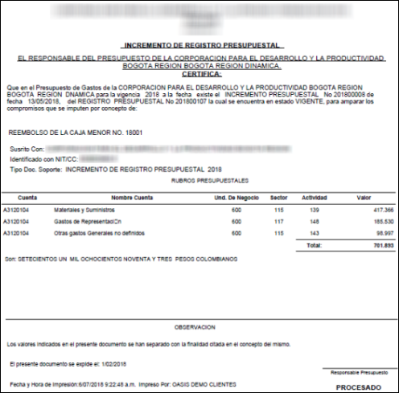

## [C3 - Cargue inicial ejecución](http://docs.oasiscom.com/Operacion/erp/presupuestoo/qmovimient/qmovo#c3---cargue-inicial-ejecución)

Esta vista previa permite visualizar el estado de las cuentas del mismo.  

Damos click en el botón _Presentación preliminar_.  

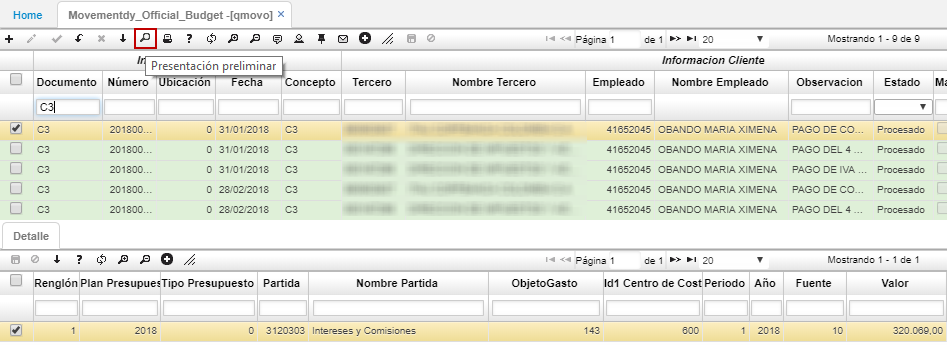

Al consultar veremos el documento de la siguiente manera:  

El documento puede ser extraíble en formato de Excel, PDF o Word.  

_En PDF_  

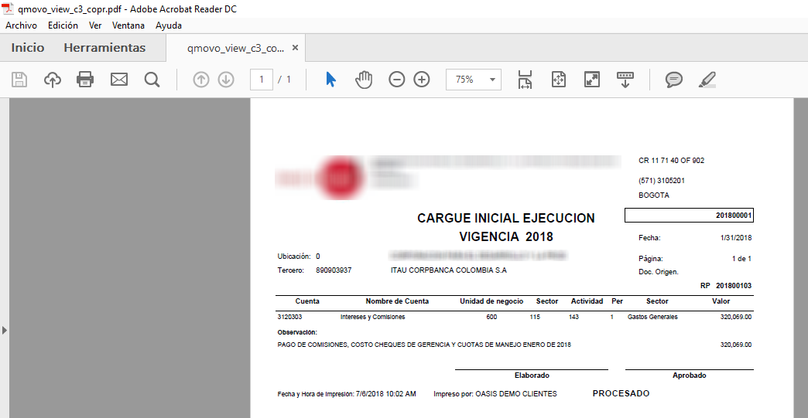

## [RD - Liberación o anulación de una provisión](http://docs.oasiscom.com/Operacion/erp/presupuestoo/qmovimient/qmovo#rd---liberación-o-anulación-de-una-provisión)

Esta vista previa permite visualizar el decremento de CDP de los rubros presupuestales.  

Damos click en el botón _Presentación preliminar_.  

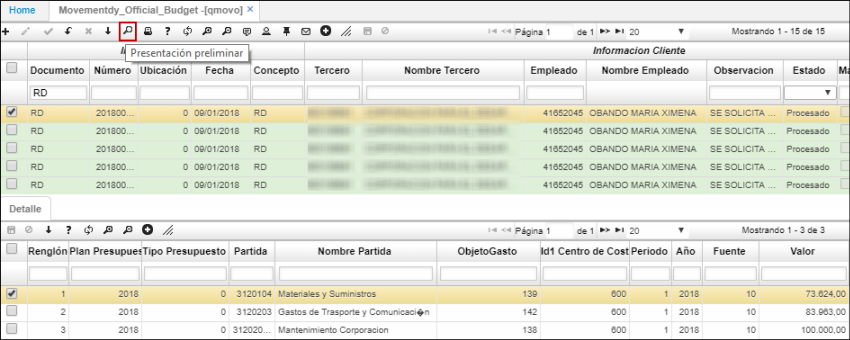

Al consultar veremos el documento de la siguiente manera:  

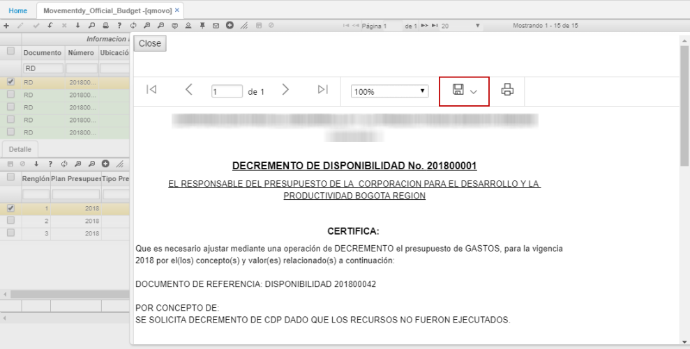

El documento puede ser extraíble en formato de Excel, PDF o Word.  

_En PDF_  

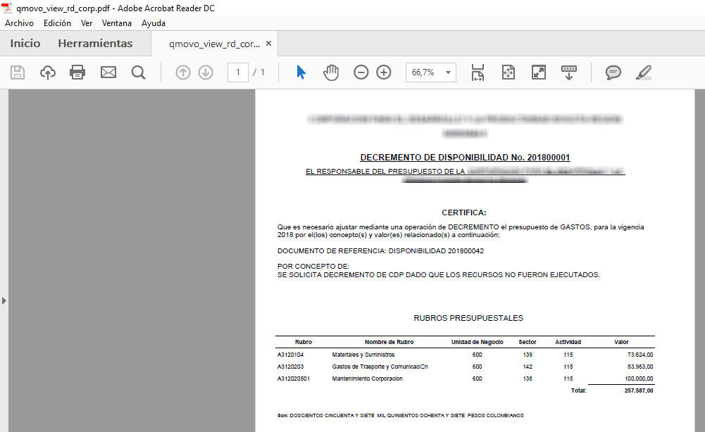

## [RR - Decremento de registro presupuestal](http://docs.oasiscom.com/Operacion/erp/presupuestoo/qmovimient/qmovo#rr---decremento-de-registro-presupuestal)

Esta vista previa permite visualizar el decremento de CRP de los rubros presupuestales.  

Damos click en el botón _Presentación preliminar_.  

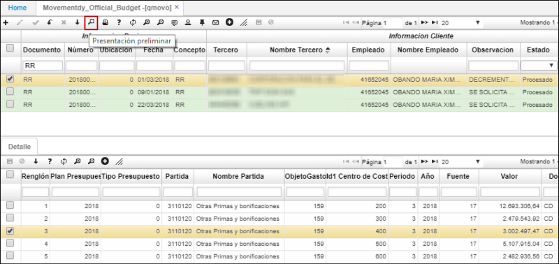

Al consultar veremos el documento de la siguiente manera:  

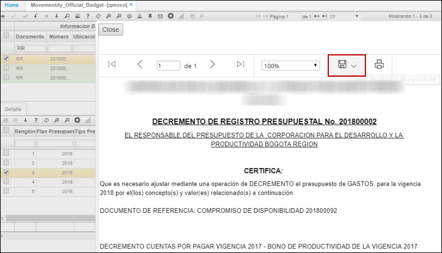

El documento puede ser extraíble en formato de Excel, PDF o Word.  

_En PDF_  

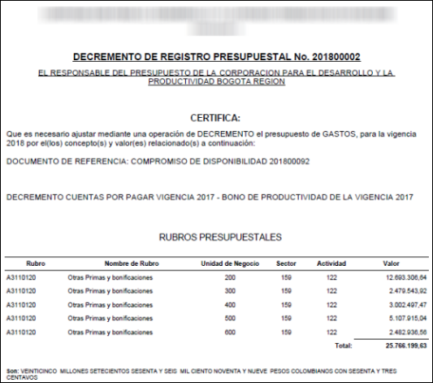

## [Fuera de Red en Presupuesto Oficial](http://docs.oasiscom.com/Operacion/erp/presupuestoo/qmovimient/qmovo#fuera_de_red_en_presupuesto_oficial)

Se crea un documento RP al momento de hacer la radicación de los prestadores fuera de red   

1.Se realiza la validación del contrato.  

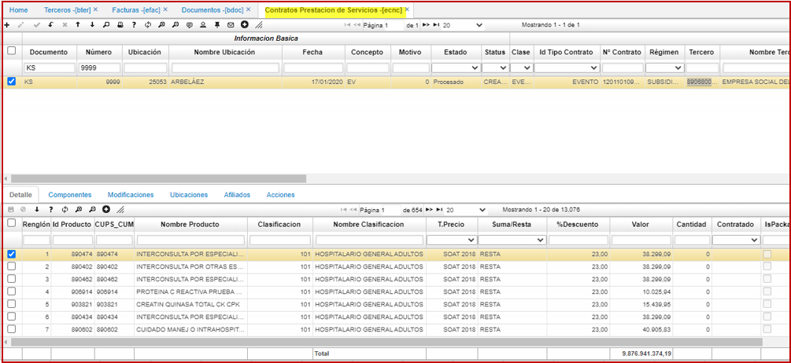  

2.Se realiza la creación del CD.  

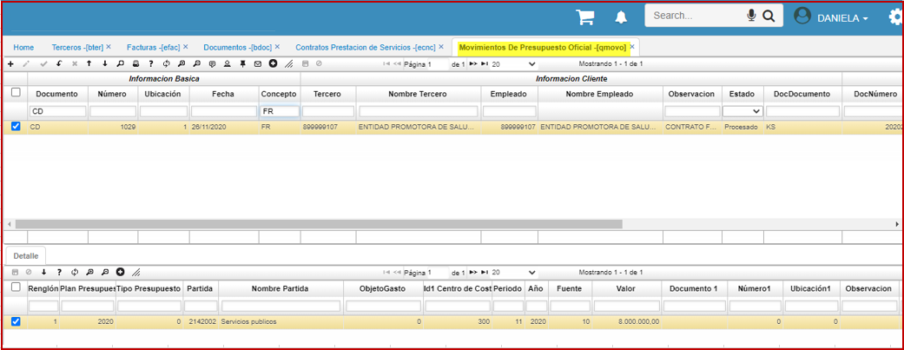  

3.Se intenta ejecutar el botón de fuera de red y si el prestador no está marcado como fuera de red el sistema arroja un mensaje de control.  

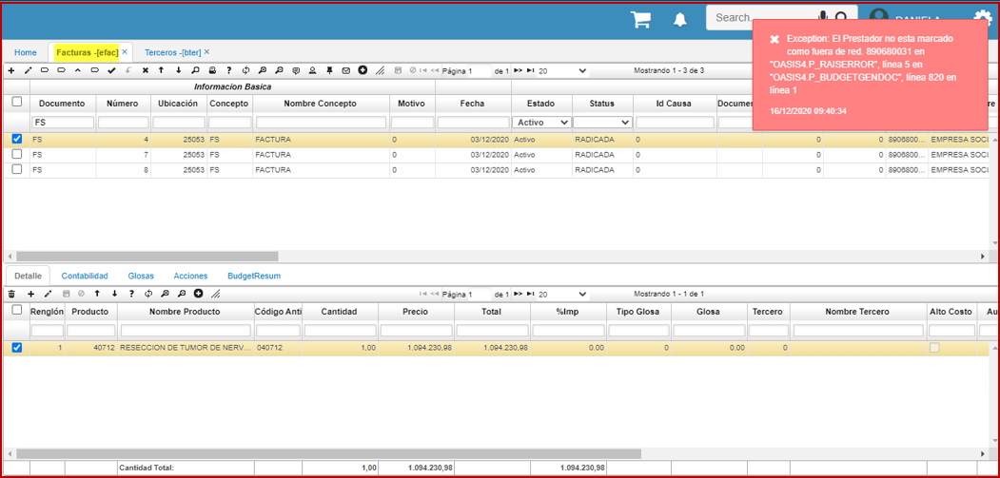  

4.Se le asigna al tercero que es fuera de red.  

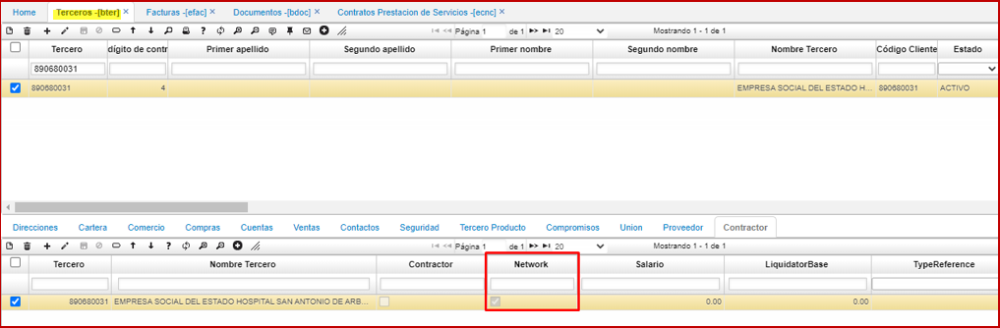  

5.Se ejecuta nuevamente el botón.  

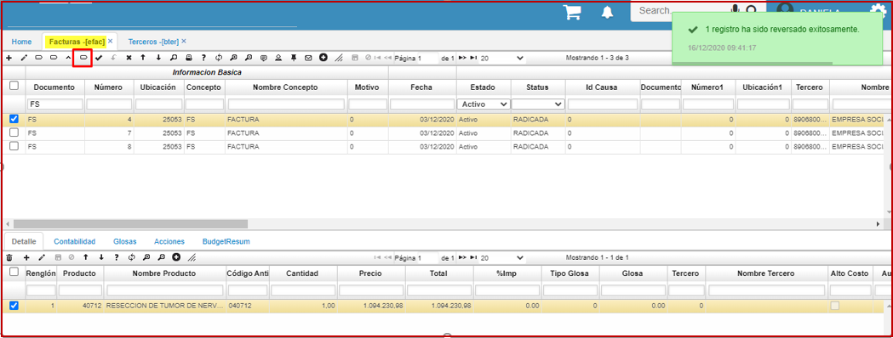  

6.Se crea el RP en estado activo al momento de ejecutar el botón.  

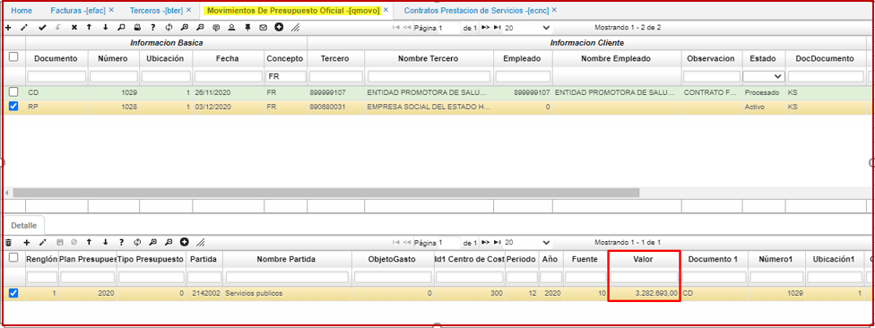  

7.Se verifica que el RP se haya creado por el mismo valor de las facturas.  

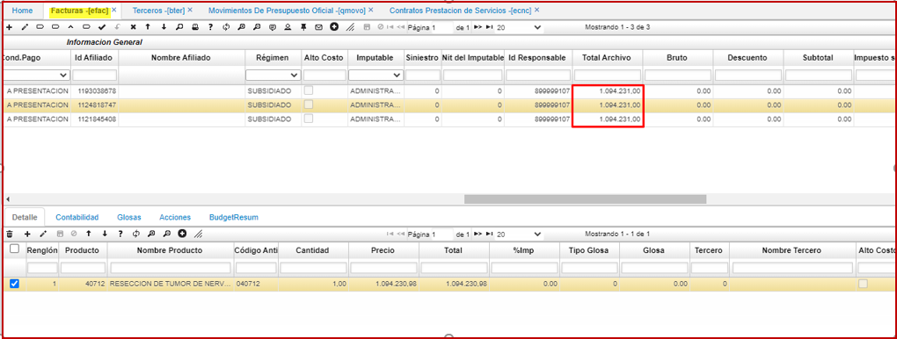  

8.Se intenta ejecutar de nuevo el botón de fuera de red pero el sistema arroja un mensaje de alerta indicando que no es posible dado que ya se creó el RP para esas facturas.  

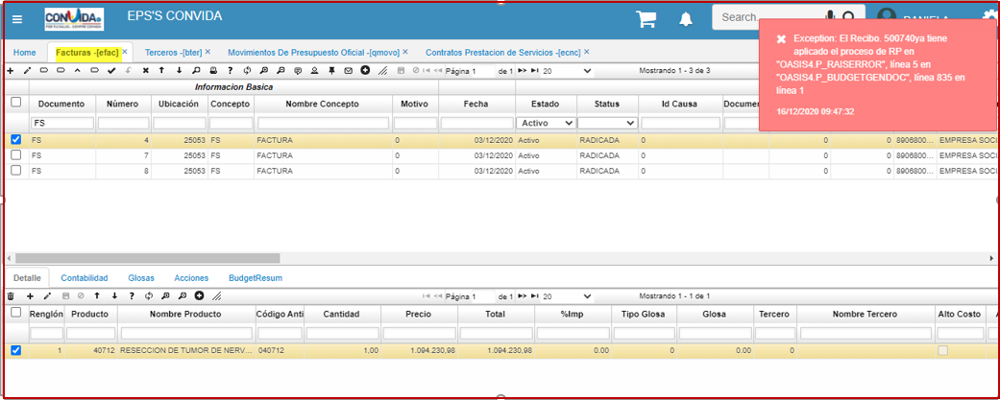  

9.Se procesa el RP.  

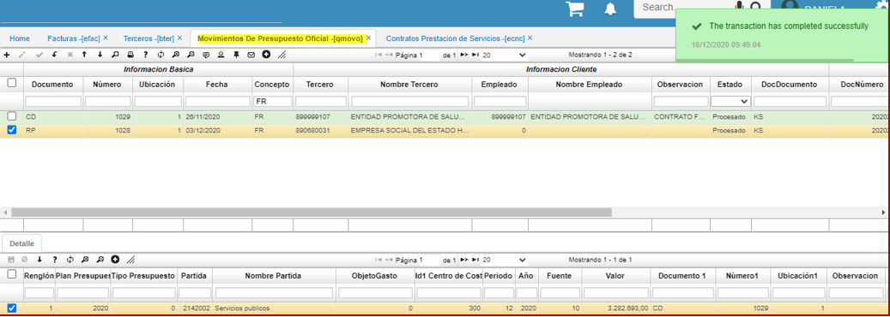  

