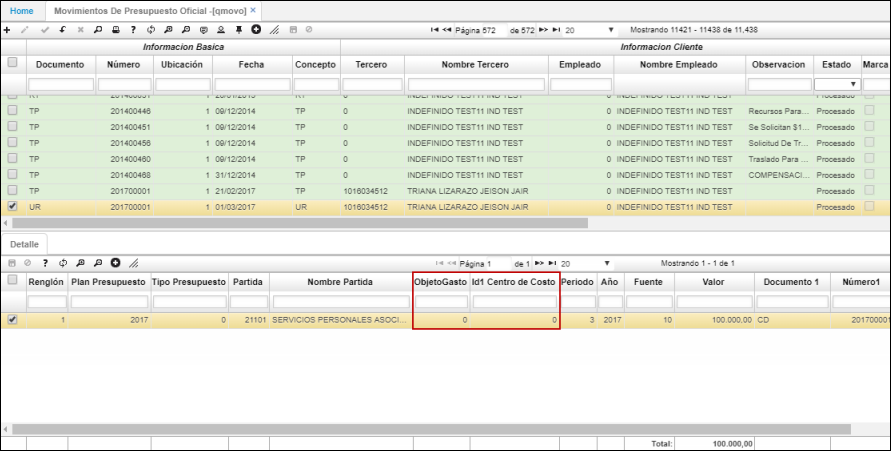

# QMOVO - Movimientos de Presupuesto Oficial

La aplicación QMOVO permite realizar movimientos en el presupuesto oficial. En el detalle, se puede indicar cual es el objeto del gasto en caso de serlo y el centro de costo al cual se carga.  

