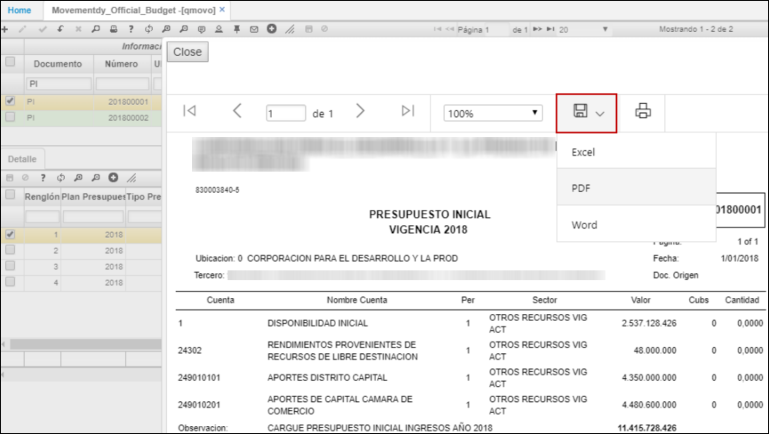
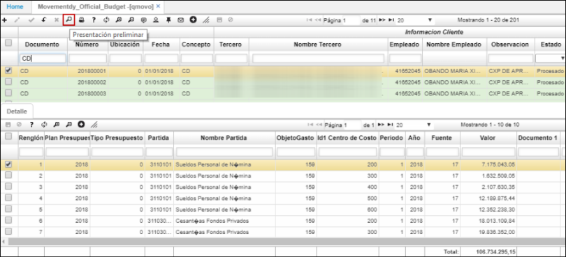
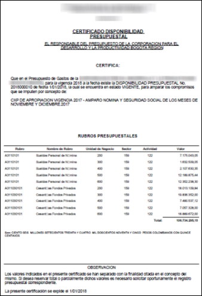
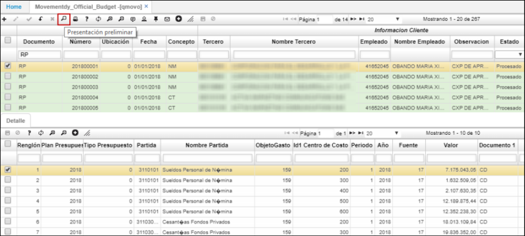
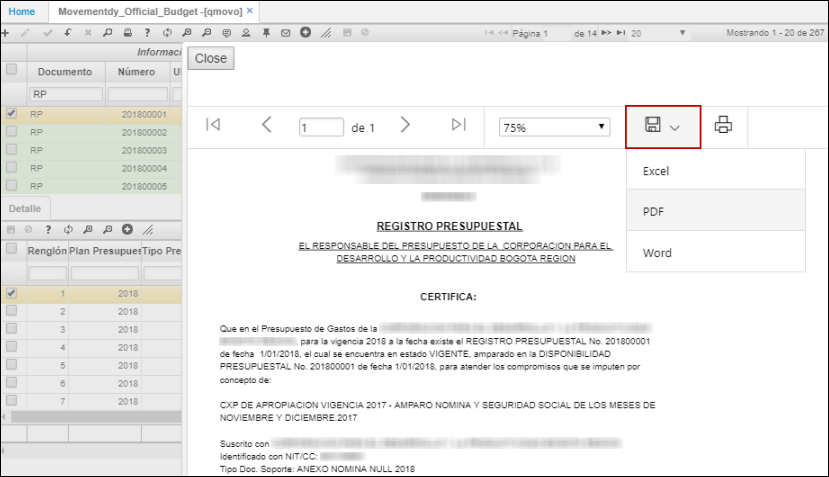
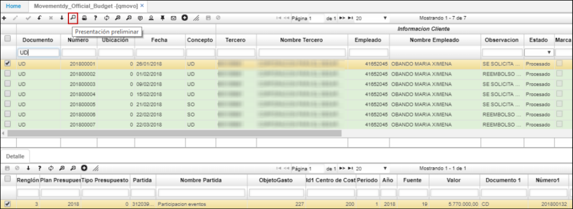
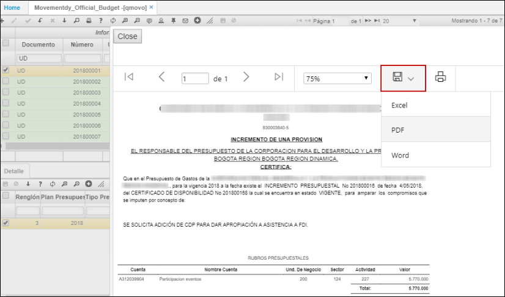
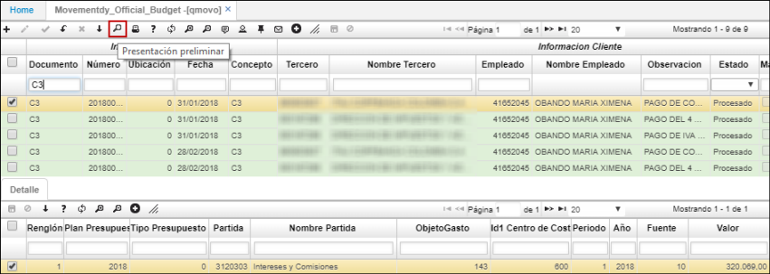
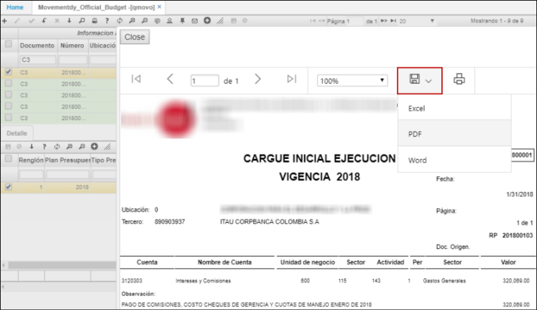

# QMOVO - Movimientos de Presupuesto Oficial

La aplicación QMOVO permite realizar movimientos en el presupuesto oficial. En el detalle, se puede indicar cual es el objeto del gasto en caso de serlo y el centro de costo al cual se carga.  

# [Vistas previas de los documentos](http://docs.oasiscom.com/Operacion/erp/presupuestoo/qmovimient/qmovo#vistas-previas-de-los-documentos)

Los documentos que se registran en la aplicación QMOVO cuentan con vistas previas que permiten ver la información de forma más clara.  

Documentos:

* [**PI - Presupuesto Inicial**](http://docs.oasiscom.com/Operacion/erp/presupuestoo/qmovimient/qmovo#pi---presupuesto-inicial)  
* [**CD - Certificado Disponibilidad Presupuestal**](http://docs.oasiscom.com/Operacion/erp/presupuestoo/qmovimient/qmovo#cd---certificado-disponibilidad-presupuestal)  
* [**RP - Registro Presupuestal**](http://docs.oasiscom.com/Operacion/erp/presupuestoo/qmovimient/qmovo#rp---registro-presupuestal)  
* [**UD - Incremento de una provisión**](http://docs.oasiscom.com/Operacion/erp/presupuestoo/qmovimient/qmovo#ud---incremento-de-una-provisión)
* [**TP - Traslado Presupuestal**](http://docs.oasiscom.com/Operacion/erp/presupuestoo/qmovimient/qmovo#tp---traslado-presupuestal)
* [**AR - Incremento de registro presupuestal**](http://docs.oasiscom.com/Operacion/erp/presupuestoo/qmovimient/qmovo#ar---incremento-de-registro-presupuestal)
* [**C3 - Cargue inicial ejecución**](http://docs.oasiscom.com/Operacion/erp/presupuestoo/qmovimient/qmovo#c3---cargue-inicial-ejecución)
*  

### [PI - Presupuesto Inicial](http://docs.oasiscom.com/Operacion/erp/presupuestoo/qmovimient/qmovo#pi---presupuesto-inicial)  

Esta vista previa permite visualizar el estado de las cuentas del presupuesto inicial.  

Damos click en el botón _Presentación preliminar_.  

Al consultar veremos el documento de la siguiente manera:  

El documento puede ser extraíble en formato de Excel, PDF o Word.  

_En PDF_  

### [CD - Certificado Disponibilidad Presupuestal](http://docs.oasiscom.com/Operacion/erp/presupuestoo/qmovimient/qmovo#cd---certificado-disponibilidad-presupuestal)  

Esta vista previa permite visualizar el estado de los rubros presupuestales.  

Damos click en el botón _Presentación preliminar_.  

Al consultar veremos el documento de la siguiente manera:  

El documento puede ser extraíble en formato de Excel, PDF o Word.  

_En PDF_  

### [RP - Registro Presupuestal](http://docs.oasiscom.com/Operacion/erp/presupuestoo/qmovimient/qmovo#rp---registro-presupuestal)

Esta vista previa permite visualizar el estado de los rubros presupuestales de dicho documento.  

Damos click en el botón _Presentación preliminar_.  

Al consultar veremos el documento de la siguiente manera:  

El documento puede ser extraíble en formato de Excel, PDF o Word.  

_En PDF_  

### [UD - Incremento de una provisión](http://docs.oasiscom.com/Operacion/erp/presupuestoo/qmovimient/qmovo#ud---incremento-de-una-provisión)

Esta vista previa permite visualizar el estado de las cuentas de los rubros presupuestales.  

Damos click en el botón _Presentación preliminar_.  

Al consultar veremos el documento de la siguiente manera:  

El documento puede ser extraíble en formato de Excel, PDF o Word.  

_En PDF_  

### [TP - Traslado Presupuestal](http://docs.oasiscom.com/Operacion/erp/presupuestoo/qmovimient/qmovo#tp---traslado-presupuestal)

Esta vista previa permite visualizar el estado de las cuentas para traslado presupuestal.  

Damos click en el botón _Presentación preliminar_.  

Al consultar veremos el documento de la siguiente manera:  

El documento puede ser extraíble en formato de Excel, PDF o Word.  

_En PDF_  

### [AR - Incremento de registro presupuestal](http://docs.oasiscom.com/Operacion/erp/presupuestoo/qmovimient/qmovo#ar---incremento-de-registro-presupuestal)

Esta vista previa permite visualizar el estado de las cuentas para incremento presupuestal.  

Damos click en el botón _Presentación preliminar_.  

Al consultar veremos el documento de la siguiente manera:  

El documento puede ser extraíble en formato de Excel, PDF o Word.  

_En PDF_  

### [C3 - Cargue inicial ejecución](http://docs.oasiscom.com/Operacion/erp/presupuestoo/qmovimient/qmovo#c3---cargue-inicial-ejecución)

Esta vista previa permite visualizar el estado de las cuentas del mismo.  

Damos click en el botón _Presentación preliminar_.  

Al consultar veremos el documento de la siguiente manera:  

El documento puede ser extraíble en formato de Excel, PDF o Word.  

_En PDF_  

