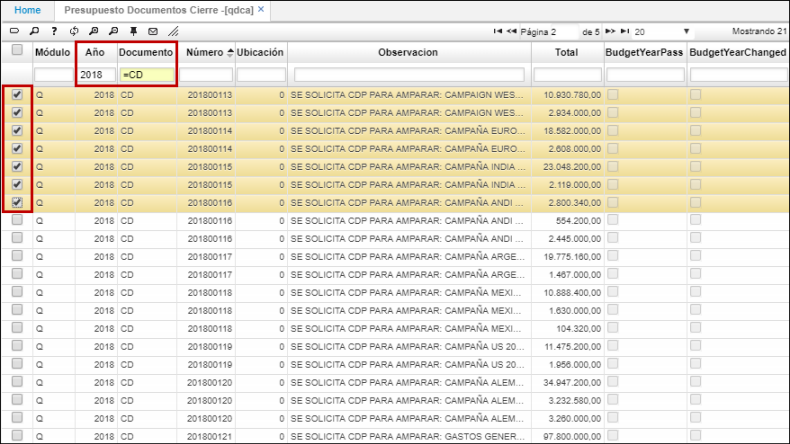
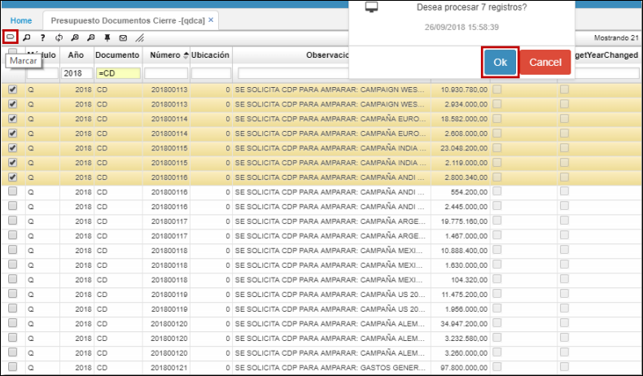
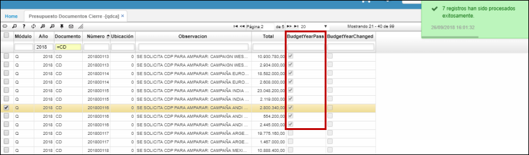

# Presupuesto Documentos Cierre - QDCA

La aplicación **QDCA** permite visualizar los documentos de cierre presupuestales y seleccionar los que se requieran pasar al siguiente año.  

Para realizar este proceso:

* Ingresamos a la aplicación **QDCA**
* Filtramos por el año de consulta
* Filtramos por el documento que se pretende seleccionar para pasar al siguiente año _(consultar con un = previo a las siglas del documento, **=CD**)_.  
* Seleccionamos los documentos deseados.  

* Una vez seleccionados, damos click en el botón _Marcar_ , este activará el flag de la columna _**Budget Year Pass**_ (Pasar presupuesto al siguiente año).  

* El sistema arrojará un mensaje de operación satisfactoria y activará las casillas de los documentos que hayan sido seleccionadas.  

Realizado lo anterior, el siguiente paso será ejecutar el procedimiento que cerrará los documentos presupuestales seleccionados. Para ello, ingresaremos a la aplicación [**QPCR - Cierre**](http://docs.oasiscom.com/Operacion/erp/presupuestoo/qproceso/qpcr) y lo generaremos por el año en el que se vaya a hacer el cierre y el documento. (_Ver aplicación_)  

